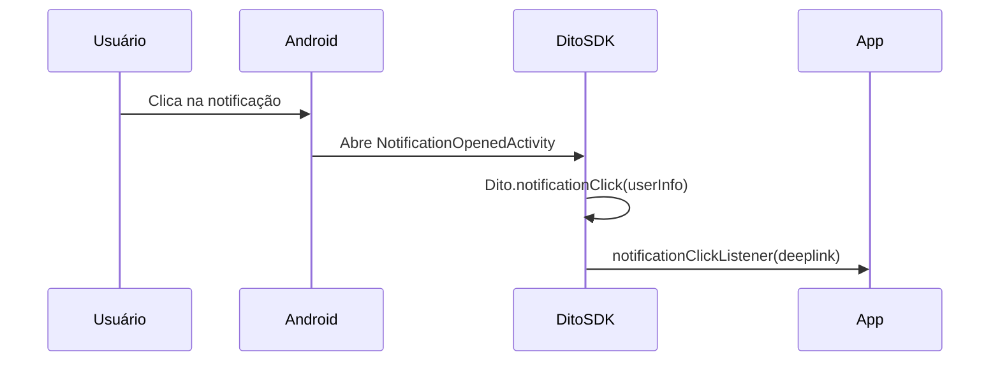
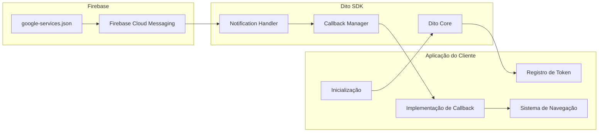

# Dito Android SDK

SDK Android nativa da Dito para integração com o CRM Dito.

## 📋 Visão Geral

O **Dito Android SDK** é a biblioteca oficial da Dito para aplicações Android, permitindo que você integre seu app com a plataforma de CRM e Marketing Automation da Dito.

Com o Dito Android SDK você pode:

- 🔐 **Identificar usuários** e sincronizar seus dados com a plataforma
- 📊 **Rastrear eventos** e comportamentos dos usuários
- 🔔 **Gerenciar notificações push** via Firebase Cloud Messaging
- 🔗 **Processar deeplinks** de notificações
- 💾 **Gerenciar dados offline** automaticamente

## 📱 Requisitos

| Requisito        | Versão Mínima |
| ---------------- | ------------- |
| Android API      | 25+           |
| Kotlin           | 1.9+          |
| Gradle           | 7.0+          |
| Firebase Android SDK | 20.0+     |

## 📦 Instalação

### Via Gradle

#### 1. Adicione o repositório no `settings.gradle.kts` (nível do projeto)

```kotlin
dependencyResolutionManagement {
    repositories {
        google()
        mavenCentral()
        maven {
            url = uri("https://maven.pkg.github.com/ditointernet/sdk-mobile")
            credentials {
                username = providers.gradleProperty("gpr.user").orNull ?: System.getenv("GITHUB_ACTOR") ?: ""
                password = providers.gradleProperty("gpr.key").orNull ?: System.getenv("GITHUB_TOKEN") ?: ""
            }
        }
    }
}
```

#### 2. Configure as credenciais do GitHub Packages

Você pode configurar via `gradle.properties`:

`~/.gradle/gradle.properties`

```
gpr.user=ditointernet
gpr.key=GITHUB_TOKEN_COM_READ_PACKAGES
```

Ou via variáveis de ambiente `GITHUB_ACTOR` e `GITHUB_TOKEN`.

#### 3. Adicione a dependência no `build.gradle.kts` do módulo do app

```kotlin
dependencies {
    implementation("br.com.dito:ditosdk:<VERSAO>")
}
```

#### 4. Sincronize o projeto

```bash
./gradlew build
```

## ⚙️ Configuração Inicial

### 1. Configure o AndroidManifest.xml

Adicione suas credenciais da Dito no `AndroidManifest.xml`:

```xml
<application>
    <meta-data
        android:name="br.com.dito.API_KEY"
        android:value="sua-api-key" />
    <meta-data
        android:name="br.com.dito.API_SECRET"
        android:value="seu-api-secret" />
</application>
```

### 2. Configure o Firebase

1. Baixe o arquivo `google-services.json` do Firebase Console
2. Adicione o arquivo ao diretório `app/` do seu projeto
3. Adicione o plugin do Google Services no `build.gradle.kts`:

```kotlin
plugins {
    id("com.google.gms.google-services")
}
```

### 3. Inicialize o SDK

```kotlin
import br.com.dito.ditosdk.Dito
import br.com.dito.ditosdk.Options
import android.app.Application

class MyApplication : Application() {
    override fun onCreate() {
        super.onCreate()

        val options = Options(retry = 5)
        options.debug = true // Opcional: habilitar logs de debug
        options.iconNotification = R.drawable.ic_notification // Opcional: ícone customizado para notificações

        Dito.init(this, options)
    }
}
```

## 📖 Métodos Disponíveis

### init

**Descrição**: Inicializa e configura o Dito SDK. Este método deve ser chamado no `Application.onCreate()`.

**Assinatura**:
```kotlin
fun init(context: Context?, options: Options?)
```

**Parâmetros**:
| Nome | Tipo | Obrigatório | Descrição |
|------|------|-------------|-----------|
| context | Context? | Sim | Contexto da aplicação |
| options | Options? | Não | Opções de configuração (retry, debug) |

**Retorno**: Nenhum

**Possíveis Erros**:
- `RuntimeException`: Lançado se `API_KEY` ou `API_SECRET` não estiverem configurados no `AndroidManifest.xml`

**Exemplo**:
```kotlin
class MyApplication : Application() {
    override fun onCreate() {
        super.onCreate()

        val options = Options(retry = 5)
        options.debug = true

        Dito.init(this, options)
    }
}
```

**Notas**:
- Deve ser chamado apenas uma vez durante o ciclo de vida da aplicação
- As credenciais devem estar configuradas no `AndroidManifest.xml`

---

### identify

**Descrição**: Identifica um usuário no CRM Dito com dados individuais.

**Assinatura**:
```kotlin
fun identify(
    id: String,
    name: String? = null,
    email: String? = null,
    customData: Map<String, Any>? = null
)
```

**Parâmetros**:
| Nome | Tipo | Obrigatório | Descrição |
|------|------|-------------|-----------|
| id | String | Sim | Identificador único do usuário |
| name | String? | Não | Nome do usuário |
| email | String? | Não | Email do usuário |
| customData | Map<String, Any>? | Não | Dados customizados adicionais |

**Retorno**: Nenhum

**Possíveis Erros**: Nenhum (operações são assíncronas e executadas em background)

**Exemplo**:
```kotlin
Dito.identify(
    id = "user123",
    name = "João Silva",
    email = "joao@example.com",
    customData = mapOf(
        "tipo_cliente" to "premium",
        "pontos" to 1500
    )
)
```

**Notas**:
- O usuário deve ser identificado antes de rastrear eventos
- Dados são sincronizados automaticamente em background
- Suporta operações offline

---

### track

**Descrição**: Rastreia um evento no CRM Dito.

**Assinatura**:
```kotlin
fun track(
    action: String,
    data: Map<String, Any>? = null
)
```

**Parâmetros**:
| Nome | Tipo | Obrigatório | Descrição |
|------|------|-------------|-----------|
| action | String | Sim | Nome da ação do evento |
| data | Map<String, Any>? | Não | Dados adicionais do evento |

**Retorno**: Nenhum

**Possíveis Erros**: Nenhum (operações são assíncronas e executadas em background)

**Exemplo**:
```kotlin
Dito.track(
    action = "purchase",
    data = mapOf(
        "product" to "item123",
        "price" to 99.99,
        "currency" to "BRL"
    )
)
```

**Notas**:
- O usuário deve ser identificado antes de rastrear eventos
- Dados são sincronizados automaticamente em background
- Suporta operações offline

---

### registerDevice

**Descrição**: Registra um token FCM (Firebase Cloud Messaging) para receber push notifications.

**Assinatura**:
```kotlin
fun registerDevice(token: String?)
```

**Parâmetros**:
| Nome | Tipo | Obrigatório | Descrição |
|------|------|-------------|-----------|
| token | String? | Sim | Token FCM do dispositivo |

**Retorno**: Nenhum

**Possíveis Erros**: Nenhum (método retorna silenciosamente se token for null ou vazio)

**Exemplo**:
```kotlin
FirebaseMessaging.getInstance().token.addOnCompleteListener { task ->
    if (!task.isSuccessful) {
        Log.w(TAG, "Fetching FCM registration token failed", task.exception)
        return@addOnCompleteListener
    }

    val token = task.result
    Dito.registerDevice(token)
}
```

**Notas**:
- Deve ser chamado após obter o token FCM do Firebase
- O token deve ser atualizado sempre que o Firebase gerar um novo token
- Se o token for null ou vazio, o método retorna silenciosamente

---

### unregisterDevice

**Descrição**: Remove o registro de um token FCM para parar de receber push notifications.

**Assinatura**:
```kotlin
fun unregisterDevice(token: String?)
```

**Parâmetros**:
| Nome | Tipo | Obrigatório | Descrição |
|------|------|-------------|-----------|
| token | String? | Sim | Token FCM do dispositivo a ser removido |

**Retorno**: Nenhum

**Possíveis Erros**: Nenhum (método retorna silenciosamente se token for null ou vazio)

**Exemplo**:
```kotlin
val token = FirebaseMessaging.getInstance().token.result
if (token != null) {
    Dito.unregisterDevice(token)
}
```

**Notas**:
- Use este método quando o usuário fizer logout ou desabilitar notificações
- Se o token for null ou vazio, o método retorna silenciosamente

---

### notificationRead

**Descrição**: Registra que uma notificação foi recebida (antes do clique).

**Assinatura**:
```kotlin
fun notificationRead(userInfo: Map<String, String>)
```

**Parâmetros**:
| Nome | Tipo | Obrigatório | Descrição |
|------|------|-------------|-----------|
| userInfo | Map<String, String> | Sim | Map contendo dados da notificação (deve conter "notification" e "reference") |

**Retorno**: Nenhum

**Possíveis Erros**: Nenhum (operações são assíncronas e executadas em background)

**Exemplo**:
```kotlin
class MyFirebaseMessagingService : FirebaseMessagingService() {
    override fun onMessageReceived(remoteMessage: RemoteMessage) {
        val data = remoteMessage.data

        val userInfo = mapOf(
            "notification" to (data["notification"] ?: ""),
            "reference" to (data["reference"] ?: ""),
            "log_id" to (data["log_id"] ?: ""),
            "notification_name" to (data["notification_name"] ?: ""),
            "user_id" to (data["user_id"] ?: "")
        )

        Dito.notificationRead(userInfo)
    }
}
```

**Notas**:
- Deve ser chamado quando uma notificação é recebida
- Funciona mesmo quando o app está em background
- O map deve conter pelo menos as chaves "notification" e "reference"

---

### notificationClick

**Descrição**: Processa o clique em uma notificação e retorna o deeplink se disponível.

**Assinatura**:
```kotlin
fun notificationClick(
    userInfo: Map<String, String>,
    callback: ((String) -> Unit)? = null
): NotificationResult
```

**Parâmetros**:
| Nome | Tipo | Obrigatório | Descrição |
|------|------|-------------|-----------|
| userInfo | Map<String, String> | Sim | Map contendo dados da notificação (deve conter "notification", "reference" e "deeplink") |
| callback | ((String) -> Unit)? | Não | Callback chamado com o deeplink |

**Retorno**: `NotificationResult` - Objeto com dados da notificação

**Possíveis Erros**: Nenhum (operações são assíncronas e executadas em background)

**Exemplo**:
```kotlin
val userInfo = mapOf(
    "notification" to "notif123",
    "reference" to "user123",
    "deeplink" to "https://app.example.com/product/123"
)

val result = Dito.notificationClick(userInfo) { deeplink ->
    // Processar deeplink
    val intent = Intent(Intent.ACTION_VIEW, Uri.parse(deeplink))
    startActivity(intent)
}
```

**Notas**:
- Deve ser chamado quando o usuário clica em uma notificação
- O callback recebe o deeplink se disponível na notificação
- Retorna um objeto `NotificationResult` com informações da notificação
- No payload do push, o campo canônico é `link`. Se você estiver montando `userInfo` manualmente, copie `link` para `deeplink` antes de chamar `notificationClick`.

### Callback global (recomendado)

Se você está usando o fluxo padrão do SDK (notificação exibida pelo próprio SDK), você pode configurar um callback global uma única vez na inicialização:

```kotlin
val options = Options(retry = 5).apply {
    notificationClickListener = { deeplink ->
        val intent = Intent(Intent.ACTION_VIEW, Uri.parse(deeplink))
        intent.addFlags(Intent.FLAG_ACTIVITY_NEW_TASK)
        startActivity(intent)
    }
}

Dito.init(this, options)
```

Fluxo (alto nível):



Diagrama de componentes (visão geral):



Exemplo de navegação com handler de deeplink (opcional):

```kotlin
val options = Options(retry = 5).apply {
    notificationClickListener = { deeplink ->
        val intent = MyDeeplinkHandler.createIntent(this@MyApplication, deeplink)
        intent.addFlags(Intent.FLAG_ACTIVITY_NEW_TASK)
        startActivity(intent)
    }
}

Dito.init(this, options)
```

---

## 🔔 Push Notifications

Para um guia completo de configuração de Push Notifications, consulte o [guia unificado](../docs/push-notifications.md).

### ⚠️ Integração com Múltiplos Serviços

Se você precisa integrar com **OneSignal, Braze, ou outros SDKs de notificação**, consulte o guia:
📖 **[Integração com Múltiplos Serviços de Notificação](docs/MULTIPLE_NOTIFICATION_SERVICES.md)**

O Android permite apenas UM `FirebaseMessagingService` por app. O guia acima mostra como criar um serviço delegador que funciona com múltiplos SDKs simultaneamente.

### Configuração Básica

1. Configure o Firebase no seu projeto

2. Configure o ícone de notificação (opcional mas recomendado):

O SDK usa o seguinte fallback para o ícone de notificação:
- `Options.iconNotification` (se configurado)
- `applicationInfo.icon` (ícone do app)
- `android.R.drawable.ic_dialog_info` (ícone padrão do Android)

**Recomendação**: Configure um ícone customizado para melhor experiência do usuário:

```kotlin
val options = Options(retry = 5)
options.iconNotification = R.drawable.ic_notification
Dito.init(this, options)
```

**Nota**: O ícone deve ser um drawable monocromático (branco com transparência) seguindo as [diretrizes do Android](https://developer.android.com/develop/ui/views/notifications/badges#design_guidelines).

3. Crie um `FirebaseMessagingService`:

```kotlin
import br.com.dito.ditosdk.Dito
import com.google.firebase.messaging.FirebaseMessagingService
import com.google.firebase.messaging.RemoteMessage

class MyFirebaseMessagingService : FirebaseMessagingService() {
    override fun onMessageReceived(remoteMessage: RemoteMessage) {
        val data = remoteMessage.data

        val userInfo = mapOf(
            "notification" to (data["notification"] ?: ""),
            "reference" to (data["reference"] ?: ""),
            "log_id" to (data["log_id"] ?: ""),
            "notification_name" to (data["notification_name"] ?: ""),
            "user_id" to (data["user_id"] ?: "")
        )

        Dito.notificationRead(userInfo)

        // Processar notificação normalmente
        // ...
    }
}
```

4. Registre o serviço no `AndroidManifest.xml`:

```xml
<service
    android:name=".MyFirebaseMessagingService"
    android:exported="false">
    <intent-filter>
        <action android:name="com.google.firebase.MESSAGING_EVENT" />
    </intent-filter>
</service>
```

## ⚠️ Tratamento de Erros

### Erros de Inicialização

**Erro**: `RuntimeException: É preciso configurar API_KEY e API_SECRET no AndroidManifest.`

**Causa**: Credenciais não configuradas no `AndroidManifest.xml`.

**Solução**: Adicione as credenciais no `AndroidManifest.xml`:

```xml
<meta-data
    android:name="br.com.dito.API_KEY"
    android:value="sua-api-key" />
<meta-data
    android:name="br.com.dito.API_SECRET"
    android:value="seu-api-secret" />
```

### Erros Comuns

**Erro: Eventos não aparecem no painel Dito**

**Checklist**:
1. ✅ `API_KEY` e `API_SECRET` corretos no AndroidManifest.xml
2. ✅ SDK inicializado (`Dito.init()`) antes de usar outros métodos
3. ✅ Usuário identificado ANTES de rastrear: `Dito.identify(id, name, email, customData)`
4. ✅ Conexão com internet (ou aguardar sincronização offline)

```kotlin
// ❌ ERRADO - evento antes da identificação
Dito.track(action = "purchase", data = mapOf("product" to "item123"))
Dito.identify(id = userId, name = "John", email = "john@example.com")

// ✅ CORRETO - identifique primeiro
Dito.identify(id = userId, name = "John", email = "john@example.com")
Dito.track(action = "purchase", data = mapOf("product" to "item123"))
```

## 🐛 Troubleshooting

### Problemas de Build

**Erro**: "Could not find br.com.dito:ditosdk:<VERSAO>"

**Solução**:

- Verifique se o repositório `https://maven.pkg.github.com/ditointernet/sdk-mobile` está configurado no `settings.gradle.kts`
- Verifique se `gpr.user` e `gpr.key` (ou `GITHUB_ACTOR` e `GITHUB_TOKEN`) estão definidos
- Verifique se o token tem permissão `read:packages`

### Problemas de Notificações

**Erro: "Invalid notification (no valid small icon)"**

**Causa**: O SDK não conseguiu encontrar um ícone válido para a notificação.

**Solução**: Configure um ícone de notificação nas opções do SDK:

```kotlin
val options = Options(retry = 5)
options.iconNotification = R.drawable.ic_notification
Dito.init(this, options)
```

Se você não configurar um ícone customizado, o SDK usará o ícone do aplicativo ou um ícone padrão do Android como fallback.

**Notificações não são recebidas**

**Checklist**:
1. ✅ Firebase configurado (`google-services.json` adicionado)
2. ✅ `FirebaseMessagingService` registrado no `AndroidManifest.xml`
3. ✅ Token FCM registrado (`Dito.registerDevice(token)`)
4. ✅ Permissões de notificação solicitadas
5. ✅ Ícone de notificação configurado (opcional mas recomendado)

## 💡 Exemplos Completos

### Exemplo Básico

```kotlin
import br.com.dito.ditosdk.Dito
import br.com.dito.ditosdk.Options
import android.app.Application

class MyApplication : Application() {
    override fun onCreate() {
        super.onCreate()

        val options = Options(retry = 5)
        options.debug = true

        Dito.init(this, options)
    }
}

// Identificar usuário após login
fun userDidLogin(userId: String, name: String, email: String) {
    Dito.identify(
        id = userId,
        name = name,
        email = email,
        customData = mapOf("source" to "android_app")
    )
}

// Rastrear evento de compra
fun userDidPurchase(productId: String, price: Double) {
    Dito.track(
        action = "purchase",
        data = mapOf(
            "product_id" to productId,
            "price" to price,
            "currency" to "BRL"
        )
    )
}
```

## 📄 Licença

Este projeto está licenciado sob uma licença proprietária. Veja [LICENSE](../LICENSE) para detalhes completos dos termos de licenciamento.

**Resumo dos Termos:**
- ✅ Permite uso das SDKs em aplicações comerciais
- ✅ Permite uso em aplicações próprias dos clientes
- ❌ Proíbe modificação do código fonte
- ❌ Proíbe cópia e redistribuição do código

## 🔗 Links Úteis

- 🌐 [Website Dito](https://www.dito.com.br)
- 📚 [Documentação Dito](https://developers.dito.com.br)
- 🔥 [Firebase Android Documentation](https://firebase.google.com/docs/android/setup)
- 🔔 [Firebase Cloud Messaging Android](https://firebase.google.com/docs/cloud-messaging/android/client)
- 📖 [Kotlin Documentation](https://kotlinlang.org/docs/home.html)
- 📦 [Gradle Documentation](https://docs.gradle.org/)
