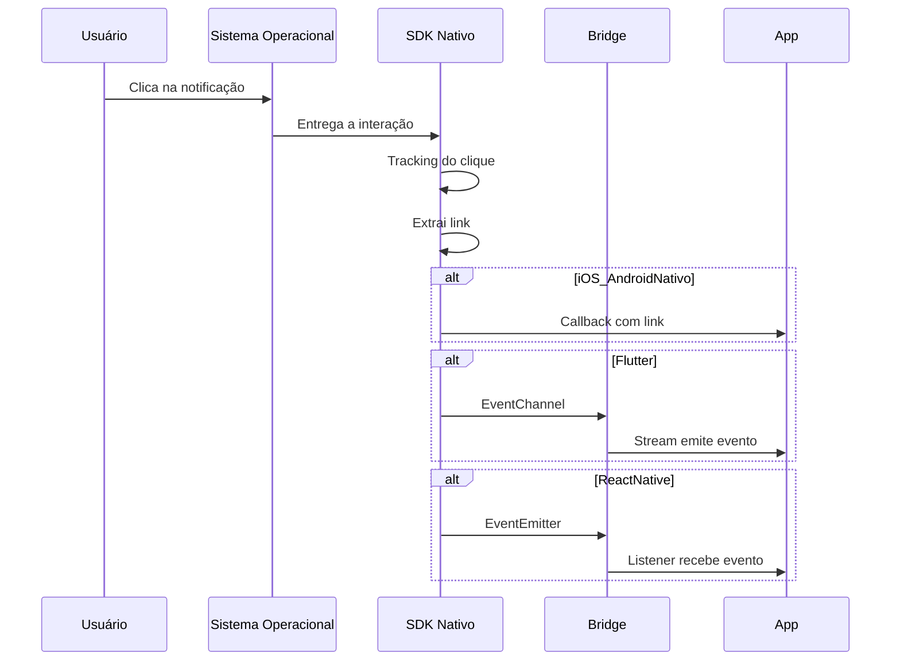
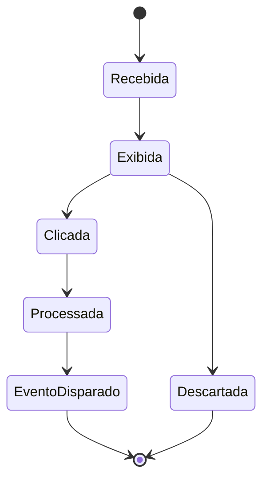
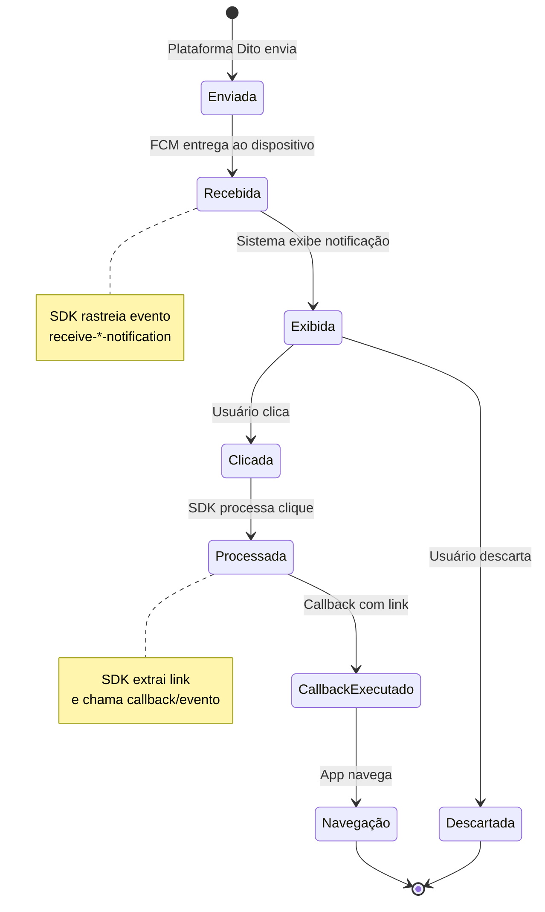
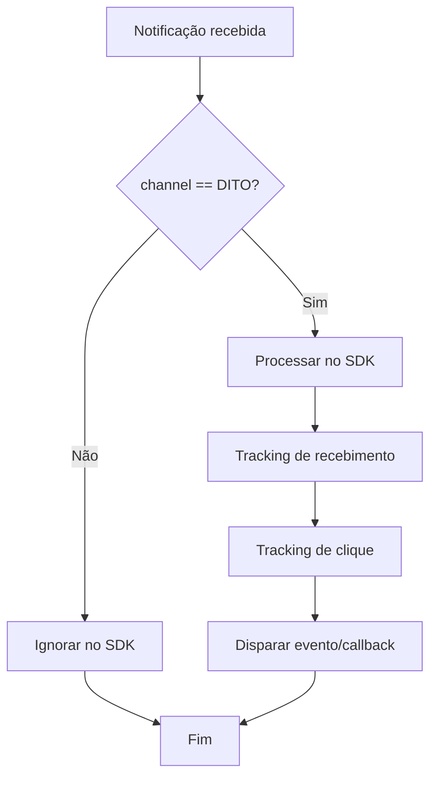
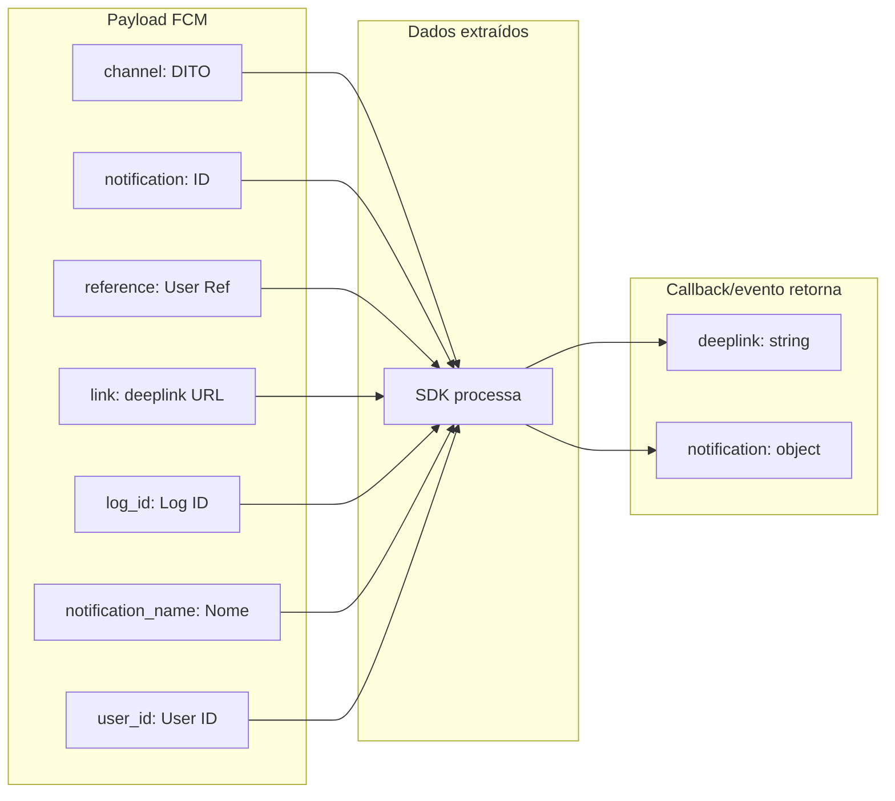
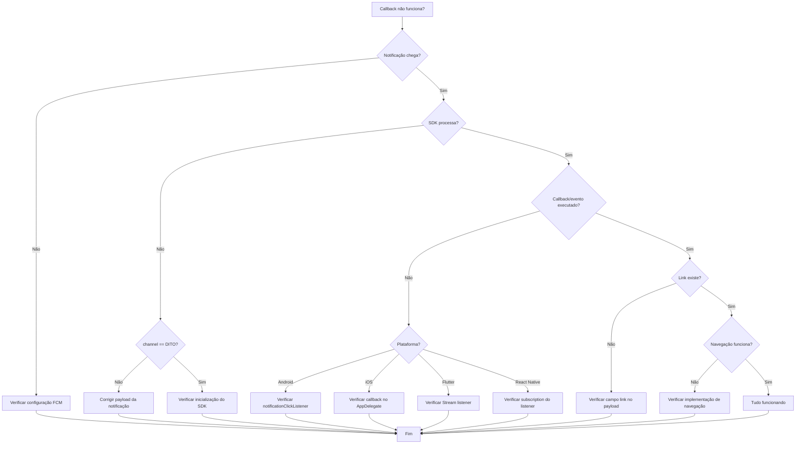

# Guia de Push Notifications

Guia unificado para configuração e uso de Push Notifications em todas as plataformas suportadas pelo Dito SDK.

## 📋 Visão Geral

O Dito SDK suporta Push Notifications via Firebase Cloud Messaging (FCM) em todas as plataformas. Este guia fornece instruções passo a passo para configurar e usar Push Notifications em iOS, Android, Flutter e React Native.

## 🔥 Configuração Firebase Geral

### 1. Criar Projeto no Firebase Console

1. Acesse o [Firebase Console](https://console.firebase.google.com/)
2. Crie um novo projeto ou selecione um existente
3. Ative o Cloud Messaging no projeto

### 2. Obter Credenciais

Cada plataforma requer arquivos de configuração específicos:
- **iOS**: `GoogleService-Info.plist`
- **Android**: `google-services.json`
- **Flutter/React Native**: Ambos os arquivos acima

## 📱 Configuração por Plataforma

### iOS

#### 1. Adicionar GoogleService-Info.plist

1. Baixe o arquivo `GoogleService-Info.plist` do Firebase Console
2. Adicione o arquivo ao projeto Xcode
3. Certifique-se de que está incluído no target do app

#### 2. Configurar Capabilities

1. No Xcode, selecione o target do app
2. Vá em **Signing & Capabilities**
3. Adicione **Push Notifications**
4. Adicione **Background Modes** e marque **Remote notifications**

#### 3. Configurar AppDelegate

Veja o exemplo completo em [iOS README](../ios/README.md#configuração-inicial).

**Ordem Importante (iOS 18+)**:
1. `FirebaseApp.configure()`
2. `Messaging.messaging().delegate = self`
3. `Dito.configure()`

### Android

#### 1. Adicionar google-services.json

1. Baixe o arquivo `google-services.json` do Firebase Console
2. Adicione o arquivo ao diretório `app/` do projeto
3. Adicione o plugin no `build.gradle.kts`:

```kotlin
plugins {
    id("com.google.gms.google-services")
}
```

#### 2. Configurar FirebaseMessagingService

Veja o exemplo completo em [Android README](../android/README.md#push-notifications).

### Flutter

#### 1. Instalar Dependências

```yaml
dependencies:
  firebase_messaging: ^14.0.0
  firebase_core: ^2.0.0
```

#### 2. Configurar Plataformas Nativas

Siga as instruções de [iOS](../ios/README.md) e [Android](../android/README.md).

#### 3. Inicializar Firebase

```dart
import 'package:firebase_core/firebase_core.dart';

void main() async {
  WidgetsFlutterBinding.ensureInitialized();
  await Firebase.initializeApp();
  runApp(MyApp());
}
```

### React Native

#### 1. Instalar Dependências

```bash
npm install @react-native-firebase/app @react-native-firebase/messaging
```

#### 2. Configurar Plataformas Nativas

Siga as instruções de [iOS](../ios/README.md) e [Android](../android/README.md).

## 🔔 Interceptação de Notificações

O SDK intercepta automaticamente notificações do canal Dito quando o campo `channel` nos dados da notificação é igual a `"DITO"` (case-insensitive).

### Como Funciona

1. Quando uma notificação é recebida, o SDK verifica o campo `channel`
2. Se `channel == "DITO"`, o SDK processa a notificação automaticamente
3. Se `channel != "DITO"`, a notificação é ignorada pelo SDK e deve ser processada normalmente pelo app

### Payload Esperado

```json
{
  "channel": "DITO",
  "notification": "notification-id",
  "reference": "user-reference",
  "link": "https://app.example.com/product/123",
  "log_id": "log-id",
  "notification_name": "Nome da Notificação",
  "user_id": "user-id"
}
```

**Notas sobre deeplink**:

- O campo canônico no payload é `link` (string).
- Os wrappers **Flutter** e **React Native** aceitam `deeplink` como alias quando você precisa montar um `userInfo` manualmente (por exemplo, vindo de `firebase_messaging`).

## 📊 Tracking Automático

O SDK rastreia automaticamente quando uma notificação é recebida:

- **iOS**: Evento `receive-ios-notification`
- **Android**: Evento `receive-android-notification`

Os eventos incluem:
- Canal: "mobile"
- Token do dispositivo
- ID do disparo (log_id)
- ID da notificação
- Nome da notificação
- Provedor: "firebase"
- Sistema operacional

## 👆 Handling de Clicks

Quando o usuário clica em uma notificação, o SDK:

1. Registra o clique no CRM Dito
2. Extrai o deeplink (`link`) se disponível
3. Dispara o evento/callback exposto pela plataforma, para que o app faça navegação (ou abra navegador, etc.)

### Fluxo (alto nível)



### Ciclo de vida (estados)



Versão detalhada (com responsabilidades do SDK):



### Decisão de processamento (payload)



### Estrutura do payload (diagrama)



### Troubleshooting (fluxo)



### Exemplo iOS

```swift
Dito.notificationClick(userInfo: userInfo) { deeplink in
    if let url = URL(string: deeplink) {
        UIApplication.shared.open(url)
    }
}
```

### Exemplo Android

```kotlin
Dito.notificationClick(userInfo) { deeplink ->
    val intent = Intent(Intent.ACTION_VIEW, Uri.parse(deeplink))
    startActivity(intent)
}
```

### Exemplo Flutter

```dart
import 'package:firebase_messaging/firebase_messaging.dart';
import 'package:dito_sdk/dito_sdk.dart';

final ditoSdk = DitoSdk();

void setupPushClickHandling() {
  DitoSdk.onNotificationClick.listen((event) {
    final deeplink = event.deeplink;
    if (deeplink.isEmpty) return;
    // Navegação do seu app aqui
  });

  FirebaseMessaging.onMessageOpenedApp.listen((message) async {
    await ditoSdk.handleNotificationClick(message.data);
  });
}
```

### Exemplo React Native

```typescript
import DitoSdk, { addNotificationClickListener } from '@ditointernet/dito-sdk';

const unsubscribe = addNotificationClickListener((event) => {
  if (!event.deeplink) return;
  // Navegação do seu app aqui
});

// Quando o clique for detectado no JS (ex.: firebase messaging), delegue para o SDK:
await DitoSdk.handleNotificationClick(message.data);
```

## 🔗 Deeplinks e Navegação

O SDK extrai automaticamente o `link` do payload da notificação e fornece através do callback/evento.

### Formato de Deeplink

O deeplink deve estar no formato de URL:
- `https://app.example.com/product/123`
- `myapp://product/123`
- `dito://action/123`

### Navegação

Cada plataforma tem sua própria forma de processar deeplinks:

- **iOS**: Usar `UIApplication.shared.open(url)`
- **Android**: Usar `Intent` com `ACTION_VIEW`
- **Flutter**: Usar plugins de navegação/deeplink
- **React Native**: Usar bibliotecas de navegação/deeplink

## 🐛 Troubleshooting Unificado

### Notificações não são recebidas

**Checklist Geral**:
1. ✅ Firebase configurado corretamente
2. ✅ Arquivos de configuração adicionados (`GoogleService-Info.plist` / `google-services.json`)
3. ✅ Permissões solicitadas
4. ✅ Token FCM registrado no SDK (`Dito.registerDevice(token)` / `DitoSdk.registerDeviceToken(token)`)
5. ✅ Campo `channel` igual a `"DITO"` no payload

### Notificações não são interceptadas pelo SDK

**Causa**: Campo `channel` não é `"DITO"` ou não está presente.

**Solução**: Certifique-se de que o payload da notificação inclui `"channel": "DITO"`.

### Deeplinks não funcionam

**Causa**: Deeplink não está no formato correto ou não está sendo processado.

**Solução**:
1. Verifique se o deeplink está no payload como `"link"`
2. Implemente o callback corretamente
3. Configure o tratamento de deeplinks no app

### iOS: Erro "APNS device token not set"

**Causa**: Ordem incorreta de inicialização no iOS 18+.

**Solução**: Siga a ordem exata:
1. `FirebaseApp.configure()`
2. `Messaging.messaging().delegate = self`
3. `Dito.configure()`
4. No `didRegisterForRemoteNotificationsWithDeviceToken`, defina `Messaging.messaging().apnsToken = deviceToken` ANTES de solicitar o token FCM

## 📝 Exemplos de Payload

### Payload Completo

```json
{
  "channel": "DITO",
  "notification": "notif-123",
  "reference": "user-456",
  "link": "https://app.example.com/product/789",
  "log_id": "log-abc",
  "notification_name": "Promoção Especial",
  "user_id": "user-456",
  "data": {
    "custom_field": "custom_value"
  }
}
```

### Payload Mínimo

```json
{
  "channel": "DITO",
  "notification": "notif-123",
  "reference": "user-456"
}
```

## 🔗 Links Úteis

- 🔥 [Firebase Cloud Messaging Documentation](https://firebase.google.com/docs/cloud-messaging)
- 📱 [iOS Push Notifications Guide](../ios/README.md#push-notifications)
- 🤖 [Android Push Notifications Guide](../android/README.md#push-notifications)
- 🎯 [Flutter Push Notifications Guide](../flutter/README.md#push-notifications)
- ⚛️ [React Native Push Notifications Guide](../react-native/README.md#push-notifications)
