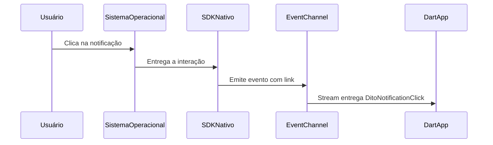
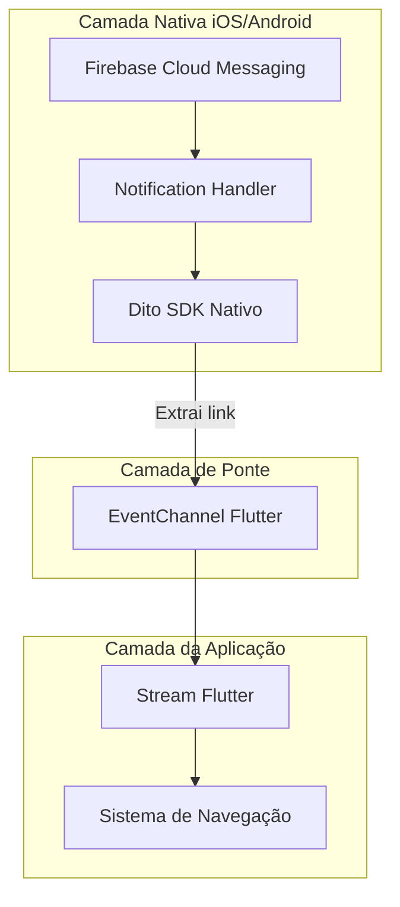

# Dito SDK Flutter Plugin

Plugin Flutter oficial da Dito para integração com o CRM Dito, fornecendo APIs unificadas para iOS e Android.

## 📋 Visão Geral

O **Dito SDK Flutter Plugin** é a biblioteca oficial da Dito para aplicações Flutter, permitindo que você integre seu app com a plataforma de CRM e Marketing Automation da Dito.

Com o Dito SDK Flutter Plugin você pode:

- 🔐 **Identificar usuários** e sincronizar seus dados com a plataforma
- 📊 **Rastrear eventos** e comportamentos dos usuários
- 🔔 **Gerenciar notificações push** via Firebase Cloud Messaging
- 💾 **Gerenciar dados offline** automaticamente

## 📱 Requisitos

| Requisito        | Versão Mínima |
| ---------------- | ------------- |
| Flutter          | 3.24.0+       |
| Dart             | 3.10.7+       |
| iOS              | 16.0+         |
| Android API      | 26+           |

## 📦 Instalação

### 1. Adicione a dependência no `pubspec.yaml`

```yaml
dependencies:
  dito_sdk:
    path: ../flutter
```

Ou se publicado no pub.dev:

```yaml
dependencies:
  dito_sdk: ^3.4.0
```

### 2. Instale as dependências

```bash
flutter pub get
```

### 3. Configure as plataformas nativas

#### Android

Para tracking de notificações em background, é necessário adicionar as credenciais no `AndroidManifest.xml` do seu app:

```xml
<application>
    <meta-data
        android:name="br.com.dito.API_KEY"
        android:value="${DITO_API_KEY}" />
    <meta-data
        android:name="br.com.dito.API_SECRET"
        android:value="${DITO_API_SECRET}" />
</application>
```

E configurar no `build.gradle.kts` do módulo `app`:

```kotlin
android {
    defaultConfig {
        // ... outras configurações

        val ditoApiKey = System.getenv("DITO_API_KEY")
            ?: (localProperties.getProperty("DITO_API_KEY") ?: "")
        val ditoApiSecret = System.getenv("DITO_API_SECRET")
            ?: (localProperties.getProperty("DITO_API_SECRET") ?: "")

        manifestPlaceholders["DITO_API_KEY"] = ditoApiKey
        manifestPlaceholders["DITO_API_SECRET"] = ditoApiSecret
    }
}
```

**Por quê?** Quando uma notificação chega em background, o SDK nativo Android precisa das credenciais para fazer tracking do evento `"receive-android-notification"` mesmo que o app não tenha sido inicializado explicitamente.

Para mais detalhes, consulte [Android](../android/README.md).

#### iOS

O plugin já configura o Firebase Messaging no iOS em tempo de execução, sem necessidade
de alterar o `AppDelegate`. Ainda assim, algumas configurações continuam obrigatórias:

- Adicionar o arquivo `GoogleService-Info.plist` no app iOS
- Habilitar Push Notifications e Background Modes (Remote notifications) no Xcode
- Configurar APNs no Firebase (chave ou certificados)

**Configuração Opcional - Credenciais no Info.plist**

Para tracking de notificações em background (similar ao Android), você pode adicionar as credenciais no `Info.plist` do seu app iOS:

```xml
<key>AppKey</key>
<string>sua-api-key</string>
<key>AppSecret</key>
<string>seu-api-secret</string>
```

**Por quê?** Se uma notificação chegar em background antes do app ter sido inicializado explicitamente, o SDK nativo iOS poderá carregar as credenciais do `Info.plist` para fazer tracking do evento `"receive-ios-notification"`.

**Nota:** Se você inicializar o SDK com `ditoSdk.initialize(...)` no `main()`, as credenciais passadas via código terão prioridade sobre as do `Info.plist`.

**Desenvolvimento — SDK iOS nativo local**

O `:path` do CocoaPods só pode ficar no **Podfile do app** (não no podspec do plugin). No sample:

```bash
DITO_USE_LOCAL_IOS_SDK=1 flutter run
# ou: touch flutter/ios/.use_local_dito_ios_sdk && flutter run
```

Exemplo no `flutter/sample_application/ios/Podfile`: declarar `pod 'DitoSDK', :path => ...` antes de `flutter_install_all_ios_pods` quando estiver em modo local.

## ⚙️ Configuração Inicial

### 1. Inicialize o SDK

```dart
import 'package:dito_sdk/dito_sdk.dart';

void main() async {
  WidgetsFlutterBinding.ensureInitialized();

  try {
    final ditoSdk = DitoSdk();
    await ditoSdk.initialize(
      appKey: "sua-api-key",
      appSecret: "seu-api-secret",
    );
    print('SDK initialized successfully');
  } catch (e) {
    print('Failed to initialize: $e');
  }

  runApp(MyApp());
}
```

## 📖 Métodos Disponíveis

Crie uma instância de `DitoSdk` e reutilize-a no app. O único membro estático é `DitoSdk.onNotificationClick` (stream de cliques em notificações).

```dart
final ditoSdk = DitoSdk();
```

### initialize

**Descrição**: Inicializa o Dito SDK com as credenciais fornecidas. Este método deve ser chamado antes de usar qualquer outro método do SDK.

**Assinatura**:
```dart
Future<void> initialize({
  required String appKey,
  required String appSecret,
})
```

**Parâmetros**:
| Nome | Tipo | Obrigatório | Descrição |
|------|------|-------------|-----------|
| appKey | String | Sim | Chave API fornecida pela Dito |
| appSecret | String | Sim | Segredo API fornecido pela Dito |

**Retorno**: `Future<void>`

**Possíveis Erros**:
- `PlatformException` com código `INVALID_PARAMETERS`: Se `appKey` ou `appSecret` forem null ou vazios
- `PlatformException` com código `INITIALIZATION_FAILED`: Se a inicialização falhar
- `PlatformException` com código `INVALID_CREDENTIALS`: Se as credenciais forem inválidas

**Exemplo**:
```dart
try {
  final ditoSdk = DitoSdk();
  await ditoSdk.initialize(
    appKey: "sua-api-key",
    appSecret: "seu-api-secret",
  );
  print('SDK initialized successfully');
} on PlatformException catch (e) {
  print('Failed to initialize: ${e.message}');
}
```

**Notas**:
- Deve ser chamado apenas uma vez durante o ciclo de vida do app
- Deve ser chamado antes de qualquer outro método do SDK

---

### identify

**Descrição**: Identifica um usuário no CRM Dito.

**Assinatura**:
```dart
Future<void> identify({
  required String id,
  String? name,
  String? email,
  Map<String, dynamic>? customData,
})
```

**Parâmetros**:
| Nome | Tipo | Obrigatório | Descrição |
|------|------|-------------|-----------|
| id | String | Sim | Identificador único do usuário |
| name | String? | Não | Nome do usuário |
| email | String? | Não | Email do usuário (deve ser válido se fornecido) |
| customData | Map<String, dynamic>? | Não | Dados customizados adicionais |

**Retorno**: `Future<void>`

**Possíveis Erros**:
- `PlatformException` com código `NOT_INITIALIZED`: Se o SDK não foi inicializado
- `PlatformException` com código `INVALID_PARAMETERS`: Se `id` for null ou vazio, ou se `email` for inválido

**Exemplo**:
```dart
final ditoSdk = DitoSdk();

try {
  await ditoSdk.identify(
    id: 'user123',
    name: 'João Silva',
    email: 'joao@example.com',
    customData: {
      'tipo_cliente': 'premium',
      'pontos': 1500,
    },
  );
} on PlatformException catch (e) {
  print('Error: ${e.message}');
}
```

**Notas**:
- O usuário deve ser identificado antes de rastrear eventos
- O email é opcional, mas se fornecido deve ser válido

---

### track

**Descrição**: Rastreia um evento no CRM Dito.

**Assinatura**:
```dart
Future<void> track({
  required String action,
  Map<String, dynamic>? data,
})
```

**Parâmetros**:
| Nome | Tipo | Obrigatório | Descrição |
|------|------|-------------|-----------|
| action | String | Sim | Nome da ação do evento |
| data | Map<String, dynamic>? | Não | Dados adicionais do evento |

**Retorno**: `Future<void>`

**Possíveis Erros**:
- `PlatformException` com código `NOT_INITIALIZED`: Se o SDK não foi inicializado
- `PlatformException` com código `INVALID_PARAMETERS`: Se `action` for null ou vazio

**Exemplo**:
```dart
final ditoSdk = DitoSdk();

try {
  await ditoSdk.track(
    action: 'purchase',
    data: {
      'product': 'item123',
      'price': 99.99,
      'currency': 'BRL',
    },
  );
} on PlatformException catch (e) {
  print('Error: ${e.message}');
}
```

**Notas**:
- O usuário deve ser identificado antes de rastrear eventos
- Dados são sincronizados automaticamente em background

---

### registerDeviceToken

**Descrição**: Registra um token de dispositivo para receber push notifications.

**Assinatura**:
```dart
Future<void> registerDeviceToken(String token)
```

**Parâmetros**:
| Nome | Tipo | Obrigatório | Descrição |
|------|------|-------------|-----------|
| token | String | Sim | Token FCM do dispositivo |

**Retorno**: `Future<void>`

**Possíveis Erros**:
- `PlatformException` com código `NOT_INITIALIZED`: Se o SDK não foi inicializado
- `PlatformException` com código `INVALID_PARAMETERS`: Se `token` for null ou vazio

**Exemplo**:
```dart
import 'package:firebase_messaging/firebase_messaging.dart';

final ditoSdk = DitoSdk();
final FirebaseMessaging _firebaseMessaging = FirebaseMessaging.instance;

Future<void> registerDevice() async {
  try {
    final token = await _firebaseMessaging.getToken();
    if (token != null) {
      await ditoSdk.registerDeviceToken(token);
    }
  } on PlatformException catch (e) {
    print('Error: ${e.message}');
  }
}
```

**Notas**:
- Deve ser chamado após obter o token FCM do Firebase
- O token deve ser atualizado sempre que o Firebase gerar um novo token

---

### unregisterDeviceToken

**Descrição**: Remove o registro de um token de dispositivo para parar de receber push notifications.

**Assinatura**:
```dart
Future<void> unregisterDeviceToken(String token)
```

**Parâmetros**:
| Nome | Tipo | Obrigatório | Descrição |
|------|------|-------------|-----------|
| token | String | Sim | Token FCM do dispositivo a ser removido |

**Retorno**: `Future<void>`

**Possíveis Erros**:
- `PlatformException` com código `NOT_INITIALIZED`: Se o SDK não foi inicializado
- `PlatformException` com código `INVALID_PARAMETERS`: Se `token` for null ou vazio

**Exemplo**:
```dart
final ditoSdk = DitoSdk();

Future<void> unregisterDevice() async {
  try {
    final token = await FirebaseMessaging.instance.getToken();
    if (token != null) {
      await ditoSdk.unregisterDeviceToken(token);
    }
  } on PlatformException catch (e) {
    print('Error: ${e.message}');
  }
}
```

**Notas**:
- Use este método quando o usuário desabilitar notificações no dispositivo (não confundir com logout de identidade no CRM — esse fluxo ainda não está exposto no plugin Flutter)

---

### setDebugMode

**Descrição**: Habilita ou desabilita logs de debug no SDK nativo. Pode ser chamado antes de `initialize`.

**Assinatura**:
```dart
Future<void> setDebugMode({required bool enabled})
```

**Exemplo**:
```dart
final ditoSdk = DitoSdk();
await ditoSdk.setDebugMode(enabled: true);
await ditoSdk.initialize(appKey: 'sua-api-key', appSecret: 'seu-api-secret');
```

---

### initializeWithApiKey

**Descrição**: Inicialização alternativa usando apenas `apiKey` e `bundleId` (sem `appSecret`). Útil em cenários onde o backend ou a configuração nativa não expõe o secret no app.

**Assinatura**:
```dart
Future<void> initializeWithApiKey({
  required String apiKey,
  required String bundleId,
})
```

**Parâmetros**:
| Nome | Tipo | Obrigatório | Descrição |
|------|------|-------------|-----------|
| apiKey | String | Sim | Chave API fornecida pela Dito |
| bundleId | String | Sim | Bundle ID / application ID do app |

**Notas**:
- Prefira `initialize(appKey:, appSecret:)` quando ambas as credenciais estiverem disponíveis
- Marca o SDK como inicializado (`isInitialized == true`) da mesma forma que `initialize`

---

### isInitialized

**Descrição**: Indica se `initialize` ou `initializeWithApiKey` foi concluído com sucesso nesta instância.

**Assinatura**:
```dart
bool get isInitialized
```

---

### getPlatformVersion

**Descrição**: Retorna a versão da plataforma nativa (utilitário do plugin).

**Assinatura**:
```dart
Future<String?> getPlatformVersion()
```

---

### handleNotificationReceived

**Descrição**: Delega o payload de uma notificação recebida ao SDK nativo (tracking, inbox). Use em handlers Dart do `firebase_messaging` quando quiser processar mensagens em background/foreground pelo canal Flutter.

**Assinatura**:
```dart
Future<bool> handleNotificationReceived(Map<String, dynamic> userInfo)
```

**Retorno**: `true` se o SDK tratou a mensagem (ex.: `channel=DITO`), `false` caso contrário.

**Exemplo** (background handler opcional):
```dart
@pragma('vm:entry-point')
Future<void> firebaseMessagingBackgroundHandler(RemoteMessage message) async {
  WidgetsFlutterBinding.ensureInitialized();
  final ditoSdk = DitoSdk();
  await ditoSdk.initialize(appKey: '...', appSecret: '...');
  await ditoSdk.handleNotificationReceived(message.data);
}
```

**Notas**:
- No iOS, receive em app morto/background costuma ser tratado pelo plugin nativo sem subir o Dart; este método é fallback ou complemento (ex.: testes, Android)
- Não exige `isInitialized` no Dart (diferente de `identify`/`track`)

---

### handleNotificationClick

**Descrição**: Delega o payload de clique em notificação ao SDK (tracking + emissão no stream `onNotificationClick` quando aplicável).

**Assinatura**:
```dart
Future<bool> handleNotificationClick(Map<String, dynamic> userInfo)
```

**Retorno**: `true` se o SDK tratou o clique.

**Exemplo**: veja [Android: quando chamar `handleNotificationClick`](#android-quando-chamar-handlenotificationclick) na seção Push Notifications.

---

### setNotificationOptions

**Descrição**: Personaliza aparência/sons de notificações push exibidas pelo SDK. Pode ser chamado antes ou depois de `initialize`.

**Assinatura**:
```dart
Future<void> setNotificationOptions(DitoNotificationOptions options)
```

**Exemplo**:
```dart
final ditoSdk = DitoSdk();

await ditoSdk.setNotificationOptions(
  DitoNotificationOptions(
    smallIconResId: 0x7f080123, // Android: resource ID (R.drawable.*)
    largeIconResId: 0x7f080124,
    soundResourceName: 'alert', // Android: sem extensão; iOS: com extensão (ex: alert.aiff)
    accentColor: 0xFF6200EE,    // Android only (ARGB)
  ),
);
```

| Campo | Tipo | Plataforma | Descrição |
|---|---|---|---|
| `smallIconResId` | `int?` | Android | Resource ID do drawable monocromático (ícone pequeno) |
| `largeIconResId` | `int?` | Android | Resource ID do drawable (ícone grande) |
| `soundResourceName` | `String?` | Android + iOS | Nome do arquivo de som no bundle nativo |
| `accentColor` | `int?` | Android | Cor de destaque ARGB (ex: `0xFF6200EE`) |

**Notas**:
- No iOS, o plugin nativo aplica apenas `soundResourceName` hoje; ícones e `accentColor` são ignorados
- Obtenha os IDs de drawable no módulo Android (mesmo valor que `R.drawable.ic_notification`)

---

### getNotifications

**Descrição**: Lista notificações persistidas na inbox local do SDK nativo.

**Assinatura**:
```dart
Future<List<DitoNotificationInfo>> getNotifications()
```

**Modelo `DitoNotificationInfo`**:

| Campo | Tipo | Descrição |
|---|---|---|
| `id` | String | ID interno do registro na inbox |
| `notificationId` | String | ID da notificação Dito |
| `reference` | String | Referência do usuário/campanha |
| `title` | String | Título exibido |
| `message` | String | Corpo da mensagem |
| `link` | String | Deeplink associado |
| `receivedAt` | DateTime | Data/hora de recebimento |
| `isRead` | bool | Se foi marcada como lida |

**Exemplo**:
```dart
final ditoSdk = DitoSdk();
final list = await ditoSdk.getNotifications();
for (final n in list) {
  print('${n.title} — lida: ${n.isRead}');
}
```

---

### markNotificationAsRead

**Descrição**: Marca uma notificação da inbox local como lida.

**Assinatura**:
```dart
Future<void> markNotificationAsRead(String id)
```

**Parâmetros**: `id` — valor `DitoNotificationInfo.id` retornado por `getNotifications()`.

---

### DitoNotificationClick (stream)

**Descrição**: Evento emitido quando o usuário clica em uma notificação Dito. Único API estática além do construtor.

**Stream**:
```dart
static Stream<DitoNotificationClick> get onNotificationClick
```

**Campos de `DitoNotificationClick`**:

| Campo | Tipo | Descrição |
|---|---|---|
| `deeplink` | String | URL de destino (`link` do payload) |
| `notificationId` | String | ID da notificação |
| `reference` | String | Referência do usuário |
| `logId` | String | ID de log/dispatch |
| `notificationName` | String | Nome da campanha/notificação |
| `userId` | String | ID do usuário associado |

**Exemplo**: veja a seção [Click em notificação e deeplink](#-click-em-notificação-e-deeplink-callback-no-dart).

---

## 🔔 Push Notifications

Para um guia completo de configuração de Push Notifications, consulte o [guia unificado](../docs/push-notifications.md).

### 🔗 Click em notificação e deeplink (callback no Dart)

O plugin expõe um stream com os cliques em notificações do canal Dito:

- **Stream**: `DitoSdk.onNotificationClick`
- **Evento**: `DitoNotificationClick` (contém `deeplink` e metadados)

Fluxo (alto nível):



Arquitetura (camadas):



Exemplo:

```dart
import 'package:dito_sdk/dito_sdk.dart';

void setupDitoNotificationClicks() {
  DitoSdk.onNotificationClick.listen((event) {
    final deeplink = event.deeplink;
    if (deeplink.isEmpty) return;
    // Navegação do seu app aqui
  });
}
```

Exemplo de navegação (GoRouter):

```dart
import 'package:go_router/go_router.dart';

void setupDitoNotificationClicks(GoRouter router) {
  DitoSdk.onNotificationClick.listen((event) {
    if (event.deeplink.isEmpty) return;
    final uri = Uri.parse(event.deeplink);
    router.push(uri.path, extra: uri.queryParameters);
  });
}
```

#### Android: quando chamar `handleNotificationClick`

No Android, se o clique for detectado no Dart (por exemplo, via `firebase_messaging`), delegue o payload para o SDK para que ele faça tracking e dispare o evento no stream:

```dart
import 'package:firebase_messaging/firebase_messaging.dart';
import 'package:dito_sdk/dito_sdk.dart';

final ditoSdk = DitoSdk();

Future<void> setupAndroidClickForwarding() async {
  FirebaseMessaging.onMessageOpenedApp.listen((message) async {
    await ditoSdk.handleNotificationClick(message.data);
  });

  final initial = await FirebaseMessaging.instance.getInitialMessage();
  if (initial != null) {
    await ditoSdk.handleNotificationClick(initial.data);
  }
}
```

### Android (Flutter) com `firebase_messaging`

No Android, o sistema executa apenas **um** `FirebaseMessagingService` por app. Se o seu app usa `firebase_messaging`, você deve criar um service delegador que:

- Delega notificações `channel=DITO` para o SDK nativo Dito
- Encaminha as demais notificações para o FlutterFire

No seu app Android, crie:

```kotlin
package com.seu.app

import br.com.dito.ditosdk.DitoMessagingServiceHelper
import com.google.firebase.messaging.RemoteMessage
import io.flutter.plugins.firebase.messaging.FlutterFirebaseMessagingService

class CustomMessagingService : FlutterFirebaseMessagingService() {
    override fun onMessageReceived(remoteMessage: RemoteMessage) {
        val handled = DitoMessagingServiceHelper.handleMessage(applicationContext, remoteMessage)
        if (!handled) {
            super.onMessageReceived(remoteMessage)
        }
    }

    override fun onNewToken(token: String) {
        super.onNewToken(token)
        DitoMessagingServiceHelper.handleNewToken(applicationContext, token)
    }
}
```

E registre no `AndroidManifest.xml` do app:

```xml
<service
    android:name=".CustomMessagingService"
    android:exported="false">
    <intent-filter>
        <action android:name="com.google.firebase.MESSAGING_EVENT" />
    </intent-filter>
</service>
```

### iOS (Flutter)

O plugin configura o Firebase Messaging e encaminha pushes `channel=DITO` para o SDK nativo **sem depender do Dart**. Com app morto, o `receive-ios-notification` dispara quando o iOS acorda o processo via `didReceiveRemoteNotification` (exige `aps.content-available: 1` no payload).

**Requisitos no app:**

1. `GoogleService-Info.plist` no target iOS
2. Push Notifications + Background Modes → **Remote notifications**
3. APNs configurado no Firebase
4. (Recomendado) `AppKey` e `AppSecret` no `Info.plist` para cold start antes de `initialize()`
5. Payload com `channel=DITO`, `user_id` (ou `userId`) e `aps.content-available: 1`

**Exemplo de payload (backend):**

```json
{
  "aps": {
    "alert": { "title": "Título", "body": "Mensagem" },
    "content-available": 1
  },
  "channel": "DITO",
  "user_id": "user-123",
  "notification": "notif-id",
  "log_id": "dispatch-id"
}
```

#### Firebase com AppDelegate custom / proxy desabilitado

O plugin registra automaticamente o delegate de push em [`DitoNotificationDelegate`](../flutter/ios/Classes/DitoNotificationDelegate.swift) via `configurePush` em [`DitoSdkPlugin.register`](../flutter/ios/Classes/DitoSdkPlugin.swift). Não é obrigatório alterar o `AppDelegate` do app para o receive em background funcionar. Com Firebase Messaging 12+, mensagens chegam via APNs (`didReceiveRemoteNotification`, `willPresent` e toque no banner); o `MessagingDelegate` expõe apenas atualização de token FCM.

Se o app usa `FirebaseAppDelegateProxyEnabled = false` (como no [sample](../flutter/sample_application/ios/Runner/Info.plist)):

1. Chame `FirebaseApp.configure()` no startup (o plugin também configura se ainda não houver instância).
2. Não substitua `UNUserNotificationCenter.current().delegate` sem encaminhar eventos ao plugin — use o delegate instalado pelo plugin ou encaminhe manualmente.
3. Persista o token FCM: o plugin grava em `UserDefaults` com a chave `FCMToken` em `didReceiveRegistrationToken`.

Se o `AppDelegate` do app implementar `application(_:didReceiveRemoteNotification:fetchCompletionHandler:)`, encaminhe ao plugin (já registrado como `FlutterApplicationDelegate`):

```swift
override func application(
  _ application: UIApplication,
  didReceiveRemoteNotification userInfo: [AnyHashable: Any],
  fetchCompletionHandler completionHandler: @escaping (UIBackgroundFetchResult) -> Void
) {
  let handled = (self as? FlutterAppDelegate)?.application(
    application,
    didReceiveRemoteNotification: userInfo,
    fetchCompletionHandler: completionHandler
  ) ?? false
  if !handled {
    completionHandler(.noData)
  }
}
```

Para troubleshooting de `receive-ios-notification` em app morto, veja [Evento receive-ios-notification não dispara em background / app morto](#evento-receive-ios-notification-não-dispara-em-background--app-morto).

### Personalização de notificações

Veja [`setNotificationOptions`](#setnotificationoptions) na seção Métodos Disponíveis.

### Notification Inbox

A inbox local (`getNotifications`, `markNotificationAsRead`) está documentada em [`getNotifications`](#getnotifications) e [`markNotificationAsRead`](#marknotificationasread).

### Configuração Básica (Flutter)

1. Configure o Firebase no seu projeto Flutter
2. Instale o plugin `firebase_messaging`:

```yaml
dependencies:
  firebase_messaging: ^14.0.0
```

3. Configure o tratamento de notificações no Dart (se aplicavel ao seu app)

## ⚠️ Tratamento de Erros

O SDK Flutter lança `PlatformException` para erros. Todos os erros incluem mensagens descritivas:

- **INITIALIZATION_FAILED**: Falha na inicialização do SDK
- **INVALID_CREDENTIALS**: Credenciais inválidas fornecidas
- **NOT_INITIALIZED**: Método chamado antes da inicialização
- **INVALID_PARAMETERS**: Parâmetros inválidos fornecidos
- **NETWORK_ERROR**: Erro de rede durante a operação

**Exemplo de tratamento de erros**:

```dart
try {
  final ditoSdk = DitoSdk();
  await ditoSdk.initialize(
    appKey: apiKey,
    appSecret: apiSecret,
  );
} on PlatformException catch (e) {
  switch (e.code) {
    case 'INITIALIZATION_FAILED':
      print('Failed to initialize SDK');
      break;
    case 'INVALID_CREDENTIALS':
      print('Invalid credentials');
      break;
    default:
      print('Error: ${e.message}');
  }
}
```

## 🐛 Troubleshooting

### Erro: "Dito SDK is not initialized"

**Solução**: Certifique-se de chamar `ditoSdk.initialize(...)` antes de usar qualquer outro método:

```dart
final ditoSdk = DitoSdk();
await ditoSdk.initialize(appKey: 'your-api-key', appSecret: 'your-api-secret');
```

### Erro: "Invalid email format"

**Solução**: Verifique se o email fornecido está no formato correto (ex: `user@example.com`). O email é opcional, então você pode passar `null` se não tiver um email válido.

### Eventos não aparecem no painel Dito

**Checklist**:
1. ✅ SDK inicializado (`ditoSdk.initialize(...)`)
2. ✅ Usuário identificado ANTES de rastrear eventos
3. ✅ Conexão com internet (ou aguardar sincronização offline)

```dart
// ❌ ERRADO - evento antes da identificação
await ditoSdk.track(action: 'purchase', data: {'product': 'item123'});
await ditoSdk.identify(id: userId, name: 'John', email: 'john@example.com');

// ✅ CORRETO - identifique primeiro
await ditoSdk.identify(id: userId, name: 'John', email: 'john@example.com');
await ditoSdk.track(action: 'purchase', data: {'product': 'item123'});
```

### Evento "receive-android-notification" não dispara em background

**Causa**: SDK não consegue se inicializar automaticamente em background sem credenciais.

**Solução**: Configure as credenciais no `AndroidManifest.xml`:

```xml
<application>
    <meta-data
        android:name="br.com.dito.API_KEY"
        android:value="${DITO_API_KEY}" />
    <meta-data
        android:name="br.com.dito.API_SECRET"
        android:value="${DITO_API_SECRET}" />
</application>
```

Veja a seção [Configure as plataformas nativas - Android](#3-configure-as-plataformas-nativas) para detalhes completos.

### Evento "receive-ios-notification" não dispara em background / app morto

**Causas comuns**:

- Payload **sem** `aps.content-available: 1` → com app morto o iOS só mostra o banner e o receive só ocorre no **toque** (comportamento da plataforma).
- `channel` diferente de `DITO`.
- `user_id` / `userId` ausente no payload (inbox local grava, ingest não recebe o track).
- FCM token não persistido: o plugin usa `UserDefaults` chave `FCMToken`; abra o app ao menos uma vez após instalar.

**Checklist**:
1. `GoogleService-Info.plist` no target iOS
2. Push Notifications e Background Modes (Remote notifications) habilitados
3. APNs configurado no Firebase
4. Backend envia `content-available: 1` em todas as pushes DITO
5. `channel=DITO` e `user_id` no payload (também aceito dentro de `data` ou `userId` em camelCase)
6. Credenciais no `Info.plist` se o app pode receber push antes do primeiro `initialize()`:

```xml
<key>AppKey</key>
<string>sua-api-key</string>
<key>AppSecret</key>
<string>seu-api-secret</string>
```

Veja [Configure as plataformas nativas - iOS](#3-configure-as-plataformas-nativas) e o [guia de push](../docs/push-notifications.md).

## 💡 Exemplos Completos

### Exemplo Básico

```dart
import 'package:dito_sdk/dito_sdk.dart';
import 'package:flutter/material.dart';

final ditoSdk = DitoSdk();

void main() async {
  WidgetsFlutterBinding.ensureInitialized();

  try {
    await ditoSdk.initialize(
      appKey: "sua-api-key",
      appSecret: "seu-api-secret",
    );
  } catch (e) {
    print('Failed to initialize: $e');
  }

  runApp(MyApp());
}

class MyApp extends StatelessWidget {
  @override
  Widget build(BuildContext context) {
    return MaterialApp(
      home: HomePage(),
    );
  }
}

class HomePage extends StatelessWidget {
  Future<void> _identifyUser() async {
    try {
      await ditoSdk.identify(
        id: 'user123',
        name: 'João Silva',
        email: 'joao@example.com',
        customData: {'source': 'flutter_app'},
      );
      print('User identified successfully');
    } catch (e) {
      print('Error: $e');
    }
  }

  Future<void> _trackEvent() async {
    try {
      await ditoSdk.track(
        action: 'purchase',
        data: {
          'product_id': 'item123',
          'price': 99.99,
          'currency': 'BRL',
        },
      );
      print('Event tracked successfully');
    } catch (e) {
      print('Error: $e');
    }
  }

  @override
  Widget build(BuildContext context) {
    return Scaffold(
      appBar: AppBar(title: Text('Dito SDK Example')),
      body: Center(
        child: Column(
          mainAxisAlignment: MainAxisAlignment.center,
          children: [
            ElevatedButton(
              onPressed: _identifyUser,
              child: Text('Identify User'),
            ),
            SizedBox(height: 16),
            ElevatedButton(
              onPressed: _trackEvent,
              child: Text('Track Event'),
            ),
          ],
        ),
      ),
    );
  }
}
```

## 📄 Licença

Este projeto está licenciado sob uma licença proprietária. Veja [LICENSE](../LICENSE) para detalhes completos dos termos de licenciamento.

**Resumo dos Termos:**
- ✅ Permite uso das SDKs em aplicações comerciais
- ✅ Permite uso em aplicações próprias dos clientes
- ❌ Proíbe modificação do código fonte
- ❌ Proíbe cópia e redistribuição do código

## 🔗 Links Úteis

- 🌐 [Website Dito](https://www.dito.com.br)
- 📚 [Documentação Dito](https://developers.dito.com.br)
- 📖 [Flutter Documentation](https://docs.flutter.dev/)
- 🎯 [Dart Documentation](https://dart.dev/guides)
- 🔥 [Firebase Flutter Documentation](https://firebase.google.com/docs/flutter/setup)

## 🛠️ Desenvolvimento no Monorepo

Este projeto usa **Melos** para gerenciamento de pacotes no monorepo.

### Setup Inicial

```bash
cd flutter
./setup_melos.sh
```

### Comandos Úteis

```bash
cd flutter
melos bootstrap        # Instalar dependências de todos os pacotes
melos run test         # Executar testes
melos run analyze      # Analisar código
melos run format       # Formatar código
melos run check        # Executar todos os checks
```

Para setup do monorepo, execute `./setup_melos.sh` na pasta `flutter` e use os comandos `melos` listados acima.
