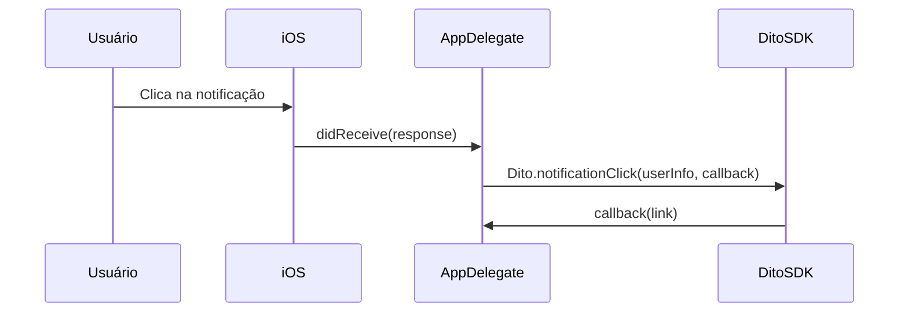
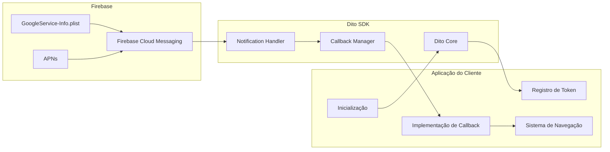

# DitoSDK para iOS

SDK iOS oficial da Dito para integração com a plataforma de CRM e Marketing Automation.

## 📋 Visão Geral

O **DitoSDK** é a biblioteca oficial da Dito para aplicações iOS, permitindo que você integre seu app com a plataforma de CRM e Marketing Automation da Dito.

Com o DitoSDK você pode:

- 🔐 **Identificar usuários** e sincronizar seus dados com a plataforma
- 📊 **Rastrear eventos** e comportamentos dos usuários
- 🔔 **Gerenciar notificações push** via Firebase Cloud Messaging
- 🔗 **Processar deeplinks** de notificações
- 💾 **Gerenciar dados offline** automaticamente
- 🔒 **Converter emails para SHA1** facilmente

## 📱 Requisitos

| Requisito        | Versão Mínima |
| ---------------- | ------------- |
| iOS              | 16.0+         |
| Xcode            | 14.0+         |
| Swift            | 5.5+          |
| Firebase iOS SDK | 9.0+          |
| CocoaPods        | 1.11.0+       |

## 📦 Instalação

### Opção 1: Via CocoaPods (Recomendado)

#### 1. Adicione o DitoSDK ao Podfile

```ruby
pod 'DitoSDK', '~> 3.0.1'
```

#### 2. Instale as dependências

```bash
pod install
```

### Opção 2: Via Swift Package Manager (SPM)

#### 1. Adicione o pacote no Xcode

1. Abra o Xcode e vá em **File > Add Package Dependencies...**
2. Cole a URL: `https://github.com/ditointernet/sdk-mobile`
3. Em **Dependency Rule**, escolha **Up to Next Major Version** e informe `3.1.3`
4. Confirme em **Add Package**

#### 2. Selecione o target

Marque o target do seu app e finalize em **Add Package**.

#### 3. Importe no código

```swift
import DitoSDK
```

> Observação: o `Package.swift` agora está na raiz do repositório. Para desenvolvimento local, você pode usar **Add Local...** apontando para `sdk-mobile/ios` se preferir.

## ⚙️ Configuração Inicial

### 1. Configure o Info.plist

Adicione suas credenciais da Dito no `Info.plist`:

```xml
<key>ApiKey</key>
<string>sua-api-key</string>
<key>ApiSecret</key>
<string>seu-api-secret</string>
```

### 2. Configure o Firebase

1. Baixe o arquivo `GoogleService-Info.plist` do Firebase Console
2. Adicione o arquivo ao seu projeto Xcode
3. Certifique-se de que o arquivo está incluído no target do app

### 3. Configure o AppDelegate

```swift
import DitoSDK
import FirebaseAnalytics
import FirebaseCore
import FirebaseMessaging
import UIKit
import UserNotifications

@main
class AppDelegate: UIResponder, UIApplicationDelegate, MessagingDelegate {
    var fcmToken: String?

    func application(
        _ application: UIApplication,
        didFinishLaunchingWithOptions launchOptions: [UIApplication.LaunchOptionsKey: Any]?
    ) -> Bool {
        // ⚠️ ORDEM IMPORTANTE para iOS 18+
        // 1. Configure Firebase PRIMEIRO
        FirebaseApp.configure()

        // 2. Define o delegate do Firebase Messaging
        Messaging.messaging().delegate = self

        // 3. Inicializa o Dito SDK
        Dito.configure()

        // 4. Configura notificações
        UNUserNotificationCenter.current().delegate = self
        registerForPushNotifications(application: application)

        return true
    }

    func application(
        _ application: UIApplication,
        didRegisterForRemoteNotificationsWithDeviceToken deviceToken: Data
    ) {
        // IMPORTANTE: setar o token APNS no Firebase Messaging ANTES de solicitar o token FCM
        Messaging.messaging().apnsToken = deviceToken

        Messaging.messaging().token { [weak self] fcmToken, error in
            if let error = error {
                print("Error fetching FCM registration token: \(error)")
            } else if let fcmToken = fcmToken {
                self?.fcmToken = fcmToken
                print("FCM registration token: \(fcmToken)")
                // Registre o token no Dito SDK
                Dito.registerDevice(token: fcmToken)
            }
        }
    }

    // MARK: Background remote notification
    func application(
        _ application: UIApplication,
        didReceiveRemoteNotification userInfo: [AnyHashable : Any],
        fetchCompletionHandler completionHandler: @escaping (UIBackgroundFetchResult) -> Void
    ) {
        let callNotificationReceived: (String) -> Void = { token in
            Dito.notificationReceived(userInfo: userInfo, token: token)
            Messaging.messaging().appDidReceiveMessage(userInfo)
            completionHandler(.newData)
        }

        if let token = self.fcmToken {
            callNotificationReceived(token)
        } else {
            Messaging.messaging().token { [weak self] token, error in
                if let token = token {
                    self?.fcmToken = token
                    callNotificationReceived(token)
                } else {
                    print("FCM token indisponível em background: \(error?.localizedDescription ?? "erro desconhecido")")
                    completionHandler(.noData)
                }
            }
        }
    }
}

extension AppDelegate: UNUserNotificationCenterDelegate {
    func userNotificationCenter(
        _ center: UNUserNotificationCenter,
        willPresent notification: UNNotification,
        withCompletionHandler completionHandler: @escaping (UNNotificationPresentationOptions) -> Void
    ) {
        let userInfo = notification.request.content.userInfo
        Messaging.messaging().appDidReceiveMessage(userInfo)
        completionHandler([[.banner, .list, .sound, .badge]])
    }

    func userNotificationCenter(
        _ center: UNUserNotificationCenter,
        didReceive response: UNNotificationResponse,
        withCompletionHandler completionHandler: @escaping () -> Void
    ) {
        let userInfo = response.notification.request.content.userInfo
        if let token = fcmToken {
            Dito.notificationReceived(userInfo: userInfo, token: token)
        }

        Dito.notificationClick(userInfo: userInfo) { deeplink in
            // Processar deeplink se necessário
            print("Deeplink recebido: \(deeplink)")
        }

        Messaging.messaging().appDidReceiveMessage(userInfo)
        completionHandler()
    }

    private func registerForPushNotifications(application: UIApplication) {
        let authOptions: UNAuthorizationOptions = [.alert, .badge, .sound]

        UNUserNotificationCenter.current().requestAuthorization(
            options: authOptions
        ) { granted, error in
            if let error = error {
                print("Error requesting notification authorization: \(error.localizedDescription)")
                return
            }

            guard granted else {
                print("Notification authorization not granted")
                return
            }

            print("Autorização de notificações concedida")
            DispatchQueue.main.async {
                application.registerForRemoteNotifications()
            }
        }
    }
}
```

## 📖 Métodos Disponíveis

### configure

**Descrição**: Inicializa e configura o Dito SDK. Este método deve ser chamado no `AppDelegate` durante o lançamento do app.

**Assinatura**:
```swift
public static func configure()
```

**Parâmetros**: Nenhum

**Retorno**: Nenhum

**Possíveis Erros**: Nenhum (método não lança erros)

**Exemplo**:
```swift
func application(
    _ application: UIApplication,
    didFinishLaunchingWithOptions launchOptions: [UIApplication.LaunchOptionsKey: Any]?
) -> Bool {
    FirebaseApp.configure()
    Messaging.messaging().delegate = self
    Dito.configure()
    return true
}
```

**Notas**:
- Deve ser chamado após `FirebaseApp.configure()` e antes de qualquer outro método do SDK
- No iOS 18+, configure o Firebase ANTES do Dito SDK

---

### identify

**Descrição**: Identifica um usuário no CRM Dito com dados individuais.

**Assinatura**:
```swift
public static func identify(
    id: String,
    name: String? = nil,
    email: String? = nil,
    customData: [String: Any]? = nil
)
```

**Parâmetros**:
| Nome | Tipo | Obrigatório | Descrição |
|------|------|-------------|-----------|
| id | String | Sim | Identificador único do usuário |
| name | String? | Não | Nome do usuário |
| email | String? | Não | Email do usuário |
| customData | [String: Any]? | Não | Dados customizados adicionais |

**Retorno**: Nenhum

**Possíveis Erros**: Nenhum (operações são assíncronas e executadas em background)

**Exemplo**:
```swift
Dito.identify(
    id: "user123",
    name: "João Silva",
    email: "joao@example.com",
    customData: [
        "tipo_cliente": "premium",
        "pontos": 1500
    ]
)
```

**Notas**:
- O usuário deve ser identificado antes de rastrear eventos
- Dados são sincronizados automaticamente em background
- Suporta operações offline

---

### track

**Descrição**: Rastreia um evento no CRM Dito.

**Assinatura**:
```swift
public static func track(
    action: String,
    data: [String: Any]? = nil
)
```

**Parâmetros**:
| Nome | Tipo | Obrigatório | Descrição |
|------|------|-------------|-----------|
| action | String | Sim | Nome da ação do evento |
| data | [String: Any]? | Não | Dados adicionais do evento |

**Retorno**: Nenhum

**Possíveis Erros**: Nenhum (operações são assíncronas e executadas em background)

**Exemplo**:
```swift
Dito.track(
    action: "purchase",
    data: [
        "product": "item123",
        "price": 99.99,
        "currency": "BRL"
    ]
)
```

**Notas**:
- O usuário deve ser identificado antes de rastrear eventos
- Dados são sincronizados automaticamente em background
- Suporta operações offline

---

### registerDevice

**Descrição**: Registra um token FCM (Firebase Cloud Messaging) para receber push notifications.

**Assinatura**:
```swift
public static func registerDevice(token: String)
```

**Parâmetros**:
| Nome | Tipo | Obrigatório | Descrição |
|------|------|-------------|-----------|
| token | String | Sim | Token FCM do dispositivo |

**Retorno**: Nenhum

**Possíveis Erros**: Nenhum (operações são assíncronas e executadas em background)

**Exemplo**:
```swift
Messaging.messaging().token { token, error in
    if let token = token {
        Dito.registerDevice(token: token)
    }
}
```

**Notas**:
- Deve ser chamado após obter o token FCM do Firebase
- O token deve ser atualizado sempre que o Firebase gerar um novo token

---

### unregisterDevice

**Descrição**: Remove o registro de um token FCM para parar de receber push notifications.

**Assinatura**:
```swift
public static func unregisterDevice(token: String)
```

**Parâmetros**:
| Nome | Tipo | Obrigatório | Descrição |
|------|------|-------------|-----------|
| token | String | Sim | Token FCM do dispositivo a ser removido |

**Retorno**: Nenhum

**Possíveis Erros**: Nenhum (operações são assíncronas e executadas em background)

**Exemplo**:
```swift
if let token = fcmToken {
    Dito.unregisterDevice(token: token)
}
```

**Notas**:
- Use este método quando o usuário fizer logout ou desabilitar notificações

---

### notificationReceived

**Descrição**: Registra que uma notificação foi recebida (antes do clique).

**Assinatura**:
```swift
public static func notificationReceived(
    userInfo: [AnyHashable: Any],
    token: String
)
```

**Parâmetros**:
| Nome | Tipo | Obrigatório | Descrição |
|------|------|-------------|-----------|
| userInfo | [AnyHashable: Any] | Sim | Dicionário com dados da notificação |
| token | String | Sim | Token FCM do dispositivo |

**Retorno**: Nenhum

**Possíveis Erros**: Nenhum (operações são assíncronas e executadas em background)

**Exemplo**:
```swift
func application(
    _ application: UIApplication,
    didReceiveRemoteNotification userInfo: [AnyHashable : Any],
    fetchCompletionHandler completionHandler: @escaping (UIBackgroundFetchResult) -> Void
) {
    if let token = fcmToken {
        Dito.notificationReceived(userInfo: userInfo, token: token)
    }
    completionHandler(.newData)
}
```

**Notas**:
- Deve ser chamado quando uma notificação é recebida
- Funciona mesmo quando o app está em background
- Para compatibilidade, `notificationRead(userInfo:token:)` ainda existe, mas está deprecated

---

### notificationClick

**Descrição**: Processa o clique em uma notificação e retorna o deeplink se disponível.

**Assinatura**:
```swift
@discardableResult
public static func notificationClick(
    userInfo: [AnyHashable: Any],
    callback: ((String) -> Void)? = nil
) -> DitoNotificationReceived
```

**Parâmetros**:
| Nome | Tipo | Obrigatório | Descrição |
|------|------|-------------|-----------|
| userInfo | [AnyHashable: Any] | Sim | Dicionário com dados da notificação |
| callback | ((String) -> Void)? | Não | Callback chamado com o deeplink |

**Retorno**: `DitoNotificationReceived` - Objeto com dados da notificação

**Possíveis Erros**: Nenhum (operações são assíncronas e executadas em background)

**Exemplo**:
```swift
func userNotificationCenter(
    _ center: UNUserNotificationCenter,
    didReceive response: UNNotificationResponse,
    withCompletionHandler completionHandler: @escaping () -> Void
) {
    let userInfo = response.notification.request.content.userInfo

    Dito.notificationClick(userInfo: userInfo) { deeplink in
        // Processar deeplink
        if let url = URL(string: deeplink) {
            UIApplication.shared.open(url)
        }
    }

    completionHandler()
}
```

**Notas**:
- Deve ser chamado quando o usuário clica em uma notificação
- O callback recebe o deeplink se disponível na notificação
- O deeplink é extraído do campo `link` do payload

Fluxo (alto nível):



Diagrama de componentes (visão geral):



---

## 🔔 Push Notifications

Para um guia completo de configuração de Push Notifications, consulte o [guia unificado](./docs/push-notifications.md).

### Personalização de Notificações Push

O DitoSDK permite personalizar o comportamento das notificações push via `DitoNotificationOptions`:

```swift
// Configure após Dito.configure(...)
Dito.setNotificationOptions(DitoNotificationOptions(
    soundName: "custom_sound.aiff", // nil = som padrão do sistema
    badgeEnabled: true               // false = SDK não gerencia badge
))
```

**Badge**: O SDK gerencia o badge automaticamente ao receber e ao clicar em notificações. Para desativar, passe `badgeEnabled: false`.

> **Limitação APNs — som em notificações remotas**: A personalização de som via `DitoNotificationOptions` afeta apenas notificações construídas localmente pelo SDK (ex.: reapresentação offline). Para notificações entregues diretamente pelo APNs, o som é definido no payload enviado pelo servidor. Se precisar modificar o conteúdo de notificações APNs no dispositivo (som, badge, attachments), é necessário implementar uma `UNNotificationServiceExtension` no app — o SDK não tem acesso ao content delivery feito pelo APNs.

### Checklist: Notificações não aparecem?

1. ✅ Firebase configurado (`GoogleService-Info.plist` adicionado)
2. ✅ Permissões solicitadas (`requestAuthorization`)
3. ✅ `registerForRemoteNotifications()` chamado
4. ✅ Token FCM registrado (`Dito.registerDevice(token:)`)
5. ✅ `Messaging.messaging().delegate = self` configurado
6. ✅ Capabilities: **Push Notifications** habilitada
7. ✅ Certificates APNs válidos no Firebase Console
8. ✅ App não tem notificações desabilitadas em Settings

## ⚠️ Tratamento de Erros

O SDK iOS não lança erros diretamente. Todas as operações são executadas em background e falhas são tratadas internamente. Para verificar se as operações foram bem-sucedidas:

1. Verifique os logs do console para mensagens de erro
2. Verifique se os dados aparecem no painel Dito
3. Certifique-se de que as credenciais estão corretas no `Info.plist`

### Erros Comuns

**Erro: "APNS device token not set before retrieving FCM Token" (iOS 18)**

**Causa**: Ordem incorreta de inicialização.

**Solução**: Siga esta ordem EXATA no AppDelegate:

```swift
func application(
    _ application: UIApplication,
    didFinishLaunchingWithOptions launchOptions: [UIApplication.LaunchOptionsKey: Any]?
) -> Bool {
    // 1️⃣ Firebase PRIMEIRO
    FirebaseApp.configure()

    // 2️⃣ Messaging delegate SEGUNDO
    Messaging.messaging().delegate = self

    // 3️⃣ Dito por último
    Dito.configure()

    return true
}

func application(
    _ application: UIApplication,
    didRegisterForRemoteNotificationsWithDeviceToken deviceToken: Data
) {
    // ⚠️ SEMPRE PRIMEIRO
    Messaging.messaging().apnsToken = deviceToken

    // Depois pedir o token FCM
    Messaging.messaging().token { token, error in
        if let token = token {
            Dito.registerDevice(token: token)
        }
    }
}
```

**Erro: Eventos não aparecem no painel Dito**

**Checklist**:
1. ✅ `apiKey` e `apiSecret` corretos no Info.plist
2. ✅ Usuário identificado ANTES de rastrear: `Dito.identify(id:name:email:customData:)`
3. ✅ Conexão com internet (ou aguardar sincronização offline)

```swift
// ❌ ERRADO - evento antes da identificação
Dito.track(action: "purchase", data: ["product": "item123"])
Dito.identify(id: userId, name: "John", email: "john@example.com")

// ✅ CORRETO - identifique primeiro
Dito.identify(id: userId, name: "John", email: "john@example.com")
Dito.track(action: "purchase", data: ["product": "item123"])
```

## 🐛 Troubleshooting

### Notificações não aparecem quando app em foreground

**Causa**: `willPresent` não mostra notificações por padrão.

**Solução**: Configure `completionHandler` com opções visuais:

```swift
func userNotificationCenter(
    _ center: UNUserNotificationCenter,
    willPresent notification: UNNotification,
    withCompletionHandler completionHandler: @escaping (UNNotificationPresentationOptions) -> Void
) {
    // Mostra com banner, lista e som
    if #available(iOS 14.0, *) {
        completionHandler([[.banner, .list, .sound, .badge]])
    } else {
        completionHandler(.alert)
    }
}
```

### Crashes de CoreData (iOS 16+)

**Causa**: Violações de thread-safety ao acessar context de threads background.

**Solução**: O DitoSDK já é otimizado para iOS 16+. Se tiver problemas, certifique-se de que não está acessando `viewContext` de thread background. O DitoSDK usa `performBackgroundTask` automaticamente.

## 💡 Exemplos Completos

### Exemplo Básico

```swift
import DitoSDK

// No AppDelegate
func application(
    _ application: UIApplication,
    didFinishLaunchingWithOptions launchOptions: [UIApplication.LaunchOptionsKey: Any]?
) -> Bool {
    FirebaseApp.configure()
    Messaging.messaging().delegate = self
    Dito.configure()
    return true
}

// Identificar usuário após login
func userDidLogin(userId: String, name: String, email: String) {
    Dito.identify(
        id: userId,
        name: name,
        email: email,
        customData: ["source": "ios_app"]
    )
}

// Rastrear evento de compra
func userDidPurchase(productId: String, price: Double) {
    Dito.track(
        action: "purchase",
        data: [
            "product_id": productId,
            "price": price,
            "currency": "BRL"
        ]
    )
}
```

## 📄 Licença

Este projeto está licenciado sob uma licença proprietária. Veja [LICENSE](../LICENSE) para detalhes completos dos termos de licenciamento.

**Resumo dos Termos:**
- ✅ Permite uso das SDKs em aplicações comerciais
- ✅ Permite uso em aplicações próprias dos clientes
- ❌ Proíbe modificação do código fonte
- ❌ Proíbe cópia e redistribuição do código

## 🔗 Links Úteis

- 🌐 [Website Dito](https://www.dito.com.br)
- 📚 [Documentação Dito](https://developers.dito.com.br)
- 🔥 [Firebase iOS Documentation](https://firebase.google.com/docs/ios/setup)
- 🔔 [Firebase Cloud Messaging iOS](https://firebase.google.com/docs/cloud-messaging/ios/client)
- 📱 [Apple User Notifications](https://developer.apple.com/documentation/usernotifications)
- 📖 [Swift Documentation](https://swift.org/documentation/)
- 📦 [CocoaPods Documentation](https://guides.cocoapods.org/)

## 📱 Sample Application

O projeto inclui um exemplo completo em `SampleApplication/` com:

- ✅ Configuração completa do Firebase
- ✅ Implementação de todos os delegates
- ✅ Identificação de usuários
- ✅ Rastreamento de eventos
- ✅ Gerenciamento de notificações
- ✅ Tratamento de deeplinks

Para executar:

```bash
cd ios
pod install
open DitoSDK.xcworkspace

# Selecione o scheme "Sample" e execute (⌘R)
```
