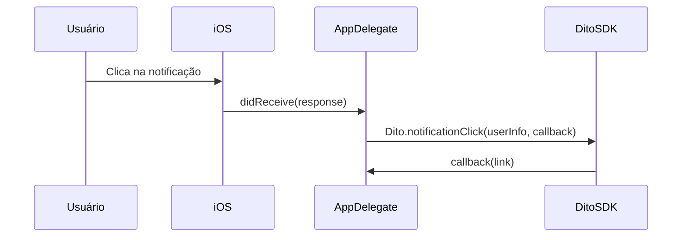
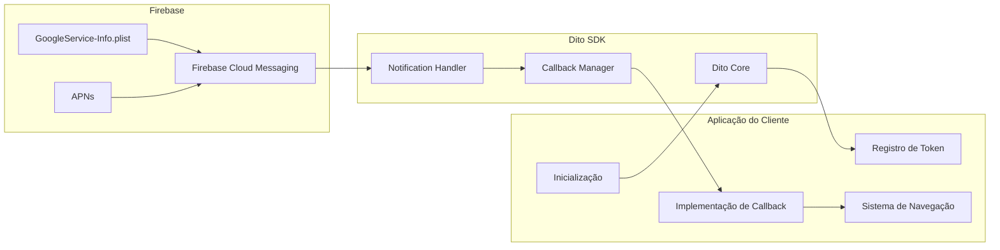

# DitoSDK para iOS

SDK iOS oficial da Dito para integração com a plataforma de CRM e Marketing Automation.

## 📋 Visão Geral

O **DitoSDK** é a biblioteca oficial da Dito para aplicações iOS, permitindo que você integre seu app com a plataforma de CRM e Marketing Automation da Dito.

Com o DitoSDK você pode:

- 🔐 **Identificar usuários** e sincronizar seus dados com a plataforma
- 📊 **Rastrear eventos** e comportamentos dos usuários
- 🔔 **Gerenciar notificações push** via Firebase Cloud Messaging
- 🔗 **Processar deeplinks** de notificações
- 💾 **Gerenciar dados offline** automaticamente
- 🔒 **Converter emails para SHA1** facilmente

## 📱 Requisitos

| Requisito        | Versão Mínima |
| ---------------- | ------------- |
| iOS              | 16.0+         |
| Xcode            | 15.3+         |
| Swift            | 5.10+         |
| Firebase iOS SDK | 9.0+          |
| CocoaPods        | 1.11.0+       |

> **Swift 5.10 é piso, não recomendação.** A SDK usa `nonisolated(unsafe)`, que só
> existe a partir do Swift 5.10 / Xcode 15.3, e os dois podspecs declaram
> `swift_version = "5.10"`. Num Xcode 14 a compilação falha — não é degradação de
> funcionalidade, é erro de build.

## 📦 Instalação

### Opção 1: Via CocoaPods (Recomendado)

#### 1. Adicione o DitoSDK ao Podfile

```ruby
pod 'DitoSDK', '~> 3.6'
```

> **Rich push (imagem e botões) exige 3.6.0 ou superior** — é a versão em que a
> Notification Service Extension passou a ser distribuída. Um pin fechado no patch,
> como `~> 3.0.1`, resolve para `< 3.1.0` e instala uma SDK sem extensão nenhuma.

#### 2. Instale as dependências

```bash
pod install
```

> Para rich push há um **segundo pod**, no target da extensão. Veja
> [Rich Push](#-rich-push-imagem-botões-e-custom-data) — as duas versões andam em
> lockstep, então o mesmo pin vale para os dois.

### Opção 2: Via Swift Package Manager (SPM)

#### 1. Adicione o pacote no Xcode

1. Abra o Xcode e vá em **File > Add Package Dependencies...**
2. Cole a URL: `https://github.com/ditointernet/sdk-mobile`
3. Em **Dependency Rule**, escolha **Up to Next Major Version** e informe `3.6.0`
4. Confirme em **Add Package**

#### 2. Selecione o target

Marque o target do seu app e finalize em **Add Package**.

#### 3. Importe no código

```swift
import DitoSDK
```

> Observação: o `Package.swift` agora está na raiz do repositório. Para desenvolvimento local, você pode usar **Add Local...** apontando para `sdk-mobile/ios` se preferir.

## ⚙️ Configuração Inicial

### 1. Configure o Info.plist

Adicione suas credenciais da Dito no `Info.plist` do **app**:

```xml
<key>AppKey</key>
<string>sua-api-key</string>
<key>AppSecret</key>
<string>seu-api-secret</string>
```

> **Os nomes são `AppKey` e `AppSecret`.** A SDK lê exatamente essas duas chaves; até
> a versão 3.5.0 este README pedia `ApiKey`/`ApiSecret`, que a SDK nunca leu. Se a sua
> integração usa os nomes antigos, ela está rodando **sem credencial** — e sem erro
> visível, porque a inicialização desiste em silêncio quando a chave vem vazia. Renomeie.

Se `AppSecret` ficar de fora, a SDK usa autenticação `X-Api-Key` com o `AppKey` e o
bundle id do app. Com os dois, usa o modelo legado (`platform_api_key` + assinatura
SHA1 da secret).

**Alternativa por código**, para quem inicializa em runtime:

```swift
Dito.configure(appKey: "sua-api-key", appSecret: "seu-api-secret")
// ou, no fluxo X-Api-Key:
Dito.configure(apiKey: "sua-api-key", bundleId: Bundle.main.bundleIdentifier!)
```

> **Se o seu app é Flutter, React Native ou qualquer híbrido, ponha as chaves no
> `Info.plist` mesmo inicializando por código.** Credencial passada por código só
> existe no processo que rodou aquele código. Num cold start provocado por push, o
> processo sobe e o Dart/JS que chamaria `configure(...)` ainda não rodou — a única
> fonte disponível é o `Info.plist`. Sem ele, o evento daquele push sai sem
> autenticação ou não sai.

### 1.1 Habilite o modo background para push

Sem isto o app não é acordado pelo push e **o evento de entrega não sai com o app
encerrado**:

```xml
<key>UIBackgroundModes</key>
<array>
  <string>remote-notification</string>
</array>
```

E confirme o entitlement `aps-environment` no target — sem ele não há push real
nenhum. Um bundle compilado com `CODE_SIGNING_ALLOWED=NO` não tem entitlements:
serve para teste local, não para validar push.

```bash
codesign -d --entitlements - SeuApp.app 2>/dev/null | grep -A1 aps-environment
```

### 2. Configure o Firebase

1. Baixe o arquivo `GoogleService-Info.plist` do Firebase Console
2. Adicione o arquivo ao seu projeto Xcode
3. Certifique-se de que o arquivo está incluído no target do app

### 3. Configure o AppDelegate

```swift
import DitoSDK
import FirebaseAnalytics
import FirebaseCore
import FirebaseMessaging
import UIKit
import UserNotifications

@main
class AppDelegate: UIResponder, UIApplicationDelegate, MessagingDelegate {
    var fcmToken: String?

    func application(
        _ application: UIApplication,
        didFinishLaunchingWithOptions launchOptions: [UIApplication.LaunchOptionsKey: Any]?
    ) -> Bool {
        // ⚠️ ORDEM IMPORTANTE para iOS 18+
        // 1. Configure Firebase PRIMEIRO
        FirebaseApp.configure()

        // 2. Define o delegate do Firebase Messaging
        Messaging.messaging().delegate = self

        // 3. Inicializa o Dito SDK
        Dito.shared.configure()

        // 4. Configura notificações
        UNUserNotificationCenter.current().delegate = self
        registerForPushNotifications(application: application)

        return true
    }

    func application(
        _ application: UIApplication,
        didRegisterForRemoteNotificationsWithDeviceToken deviceToken: Data
    ) {
        // IMPORTANTE: setar o token APNS no Firebase Messaging ANTES de solicitar o token FCM
        Messaging.messaging().apnsToken = deviceToken

        Messaging.messaging().token { [weak self] fcmToken, error in
            if let error = error {
                print("Error fetching FCM registration token: \(error)")
            } else if let fcmToken = fcmToken {
                self?.fcmToken = fcmToken
                print("FCM registration token: \(fcmToken)")
                // Registre o token no Dito SDK
                Dito.registerDevice(token: fcmToken)
            }
        }
    }

    // MARK: Background remote notification
    func application(
        _ application: UIApplication,
        didReceiveRemoteNotification userInfo: [AnyHashable : Any],
        fetchCompletionHandler completionHandler: @escaping (UIBackgroundFetchResult) -> Void
    ) {
        let callNotificationReceived: (String) -> Void = { token in
            Dito.notificationReceived(userInfo: userInfo, token: token) { result in
                Messaging.messaging().appDidReceiveMessage(userInfo)
                switch result {
                case .success:
                    completionHandler(.newData)
                case .failure:
                    completionHandler(.failed)
                }
            }
        }

        let cachedToken = fcmToken ?? UserDefaults.standard.string(forKey: "FCMToken")
        if let token = cachedToken, !token.trimmingCharacters(in: .whitespacesAndNewlines).isEmpty {
            callNotificationReceived(token)
        } else {
            Messaging.messaging().token { [weak self] token, error in
                if let token = token, !token.trimmingCharacters(in: .whitespacesAndNewlines).isEmpty {
                    self?.fcmToken = token
                    UserDefaults.standard.set(token, forKey: "FCMToken")
                    callNotificationReceived(token)
                } else {
                    print("FCM token indisponível em background: \(error?.localizedDescription ?? "erro desconhecido")")
                    completionHandler(.noData)
                }
            }
        }
    }
}

extension AppDelegate: UNUserNotificationCenterDelegate {
    func userNotificationCenter(
        _ center: UNUserNotificationCenter,
        willPresent notification: UNNotification,
        withCompletionHandler completionHandler: @escaping (UNNotificationPresentationOptions) -> Void
    ) {
        let userInfo = notification.request.content.userInfo

        // Com o app em primeiro plano, este é o callback que reporta a entrega:
        // `didReceiveRemoteNotification` não é garantido aqui.
        let cachedToken = fcmToken ?? UserDefaults.standard.string(forKey: "FCMToken")
        if let token = cachedToken, !token.isEmpty {
            Dito.notificationReceived(userInfo: userInfo, token: token)
        }

        Messaging.messaging().appDidReceiveMessage(userInfo)
        completionHandler([[.banner, .list, .sound, .badge]])
    }

    func userNotificationCenter(
        _ center: UNUserNotificationCenter,
        didReceive response: UNNotificationResponse,
        withCompletionHandler completionHandler: @escaping () -> Void
    ) {
        let userInfo = response.notification.request.content.userInfo

        // Passe a `response` inteira, não só o `userInfo`: é o
        // `response.actionIdentifier` que diz **qual botão** de rich push foi
        // tocado. Com apenas o `userInfo`, o clique chega ao painel sem
        // `action_id` e sem `action_label`, e a atribuição do botão se perde.
        Dito.notificationClick(response: response) { deeplink in
            // `deeplink` é o link do botão tocado, com fallback para o link do push.
            print("Deeplink recebido: \(deeplink)")
        }

        Messaging.messaging().appDidReceiveMessage(userInfo)
        completionHandler()
    }

    private func registerForPushNotifications(application: UIApplication) {
        let authOptions: UNAuthorizationOptions = [.alert, .badge, .sound]

        UNUserNotificationCenter.current().requestAuthorization(
            options: authOptions
        ) { granted, error in
            if let error = error {
                print("Error requesting notification authorization: \(error.localizedDescription)")
                return
            }

            guard granted else {
                print("Notification authorization not granted")
                return
            }

            print("Autorização de notificações concedida")
            DispatchQueue.main.async {
                application.registerForRemoteNotifications()
            }
        }
    }
}
```

### 3.1 Token FCM, UserDefaults e cold start

Para `Dito.notificationReceived(userInfo:token:)` em **background** ou após reinício do processo, não dependa apenas da propriedade `fcmToken` em memória.

- Guarde o token FCM em `UserDefaults` na **primeira** vez que o obtiver e sempre que o Firebase devolver um valor **diferente** (incluindo `Messaging.messaging(_:didReceiveRegistrationToken:)`).
- Opcional: após `FirebaseApp.configure()`, reatribua `fcmToken` a partir do valor persistido para o primeiro push em cold start.
- O evento automático `receive-ios-notification` **só é enviado ao ingest** se o payload incluir `user_id` ou `userId` (topo, `data` ou `gcm`; `String` ou `NSNumber`). Sem isso, a inbox local grava e o ingest não recebe o track.
- Em background, chame `fetchCompletionHandler` **após** o `completion` de `notificationReceived`, para o iOS não suspender o processo antes do ingest terminar.
- A **inbox** (`Dito.shared.getNotifications()`, Core Data) e ficheiros de debug gravados pela app são **origens distintas**. Uma falha ao serializar o `userInfo` para JSON num ficheiro de debug não impede a inbox de ser atualizada quando `notificationReceived` corre.

Referência no repositório: [`SampleApplication/AppDelegate.swift`](SampleApplication/AppDelegate.swift) e [`SampleApplication/NotificationDebugHelper.swift`](SampleApplication/NotificationDebugHelper.swift).

## 📖 Métodos Disponíveis

### configure (instância)

**Descrição**: Inicializa e configura o Dito SDK. Este método deve ser chamado no `AppDelegate` durante o lançamento do app.

**Assinatura**:
```swift
public func configure()
```

**Parâmetros**: Nenhum

**Retorno**: Nenhum

**Possíveis Erros**: Nenhum (método não lança erros)

**Exemplo**:
```swift
func application(
    _ application: UIApplication,
    didFinishLaunchingWithOptions launchOptions: [UIApplication.LaunchOptionsKey: Any]?
) -> Bool {
    FirebaseApp.configure()
    Messaging.messaging().delegate = self
    Dito.shared.configure()
    return true
}
```

Chame sempre na instância partilhada: `Dito.shared.configure()`.

**Notas**:
- Deve ser chamado após `FirebaseApp.configure()` e antes de qualquer outro método do SDK
- No iOS 18+, configure o Firebase ANTES do Dito SDK

---

### identify

**Descrição**: Identifica um usuário no CRM Dito com dados individuais.

**Assinatura**:
```swift
public static func identify(
    id: String,
    name: String? = nil,
    email: String? = nil,
    customData: [String: Any]? = nil
)
```

**Parâmetros**:
| Nome | Tipo | Obrigatório | Descrição |
|------|------|-------------|-----------|
| id | String | Sim | Identificador único do usuário |
| name | String? | Não | Nome do usuário |
| email | String? | Não | Email do usuário |
| customData | [String: Any]? | Não | Dados customizados adicionais |

**Retorno**: Nenhum

**Possíveis Erros**: Nenhum (operações são assíncronas e executadas em background)

**Exemplo**:
```swift
Dito.identify(
    id: "user123",
    name: "João Silva",
    email: "joao@example.com",
    customData: [
        "tipo_cliente": "premium",
        "pontos": 1500
    ]
)
```

**Notas**:
- O usuário deve ser identificado antes de rastrear eventos
- Dados são sincronizados automaticamente em background
- Suporta operações offline

---

### logout

**Descrição**: Limpa localmente os dados de identificação do usuário atual.

**Assinatura**:
```swift
Dito.logout()
```

**Parâmetros**: Nenhum

**Retorno**: Nenhum

**Possíveis Erros**: Nenhum (a operação é local)

**Exemplo**:
```swift
func userDidLogout() {
    Dito.logout()
}
```

**Notas**:
- Remove os dados locais salvos por `identify`
- Remove a identidade local usada por `track`
- Não remove a configuração da SDK, opções de notificação, inbox de notificações ou token remoto de push

---

### track

**Descrição**: Rastreia um evento no CRM Dito.

**Assinatura**:
```swift
public static func track(
    action: String,
    data: [String: Any]? = nil
)
```

**Parâmetros**:
| Nome | Tipo | Obrigatório | Descrição |
|------|------|-------------|-----------|
| action | String | Sim | Nome da ação do evento |
| data | [String: Any]? | Não | Dados adicionais do evento |

**Retorno**: Nenhum

**Possíveis Erros**: Nenhum (operações são assíncronas e executadas em background)

**Exemplo**:
```swift
Dito.track(
    action: "purchase",
    data: [
        "product": "item123",
        "price": 99.99,
        "currency": "BRL"
    ]
)
```

**Notas**:
- O usuário deve ser identificado antes de rastrear eventos
- Dados são sincronizados automaticamente em background
- Suporta operações offline

---

### registerDevice

**Descrição**: Registra um token FCM (Firebase Cloud Messaging) para receber push notifications.

**Assinatura**:
```swift
public static func registerDevice(token: String)
```

**Parâmetros**:
| Nome | Tipo | Obrigatório | Descrição |
|------|------|-------------|-----------|
| token | String | Sim | Token FCM do dispositivo |

**Retorno**: Nenhum

**Possíveis Erros**: Nenhum (operações são assíncronas e executadas em background)

**Exemplo**:
```swift
Messaging.messaging().token { token, error in
    if let token = token {
        Dito.registerDevice(token: token)
    }
}
```

**Notas**:
- Deve ser chamado após obter o token FCM do Firebase
- O token deve ser atualizado sempre que o Firebase gerar um novo token

---

### unregisterDevice

**Descrição**: Remove o registro de um token FCM para parar de receber push notifications.

**Assinatura**:
```swift
public static func unregisterDevice(token: String)
```

**Parâmetros**:
| Nome | Tipo | Obrigatório | Descrição |
|------|------|-------------|-----------|
| token | String | Sim | Token FCM do dispositivo a ser removido |

**Retorno**: Nenhum

**Possíveis Erros**: Nenhum (operações são assíncronas e executadas em background)

**Exemplo**:
```swift
if let token = fcmToken {
    Dito.unregisterDevice(token: token)
}
```

**Notas**:
- Use este método quando o usuário fizer logout ou desabilitar notificações

---

### notificationReceived

**Descrição**: Registra que uma notificação foi recebida (antes do clique).

**Assinatura**:
```swift
public static func notificationReceived(
    userInfo: [AnyHashable: Any],
    token: String,
    completion: ((Result<Void, Error>) -> Void)? = nil
)
```

**Parâmetros**:
| Nome | Tipo | Obrigatório | Descrição |
|------|------|-------------|-----------|
| userInfo | [AnyHashable: Any] | Sim | Dicionário com dados da notificação |
| token | String | Sim | Token FCM do dispositivo |
| completion | ((Result<Void, Error>) -> Void)? | Não | Chamado após ingest ou persistência offline; use em background antes de `fetchCompletionHandler` |

**Retorno**: Nenhum

**Possíveis Erros**: Nenhum (operações são assíncronas e executadas em background)

**Exemplo**:
```swift
func application(
    _ application: UIApplication,
    didReceiveRemoteNotification userInfo: [AnyHashable : Any],
    fetchCompletionHandler completionHandler: @escaping (UIBackgroundFetchResult) -> Void
) {
    let token = fcmToken ?? UserDefaults.standard.string(forKey: "FCMToken") ?? ""
    guard !token.isEmpty else {
        completionHandler(.noData)
        return
    }
    Dito.notificationReceived(userInfo: userInfo, token: token) { result in
        switch result {
        case .success:
            completionHandler(.newData)
        case .failure:
            completionHandler(.failed)
        }
    }
}
```

**Notas**:
- Deve ser chamado quando uma notificação é recebida
- Funciona mesmo quando o app está em background
- **Chamar duas vezes para o mesmo push é seguro.** A SDK deduplica por
  `notification`/`log_id`, então reportar em `willPresent` e em
  `didReceiveRemoteNotification` — o que acontece com o app em primeiro plano — envia
  um evento só. Se precisar consultar esse estado, existe
  `Dito.shouldDeliverReceiveNotification(notification:logId:)`
- Para compatibilidade, `notificationRead(userInfo:token:)` ainda existe, mas está deprecated

---

### notificationClick

**Descrição**: Processa o clique em uma notificação e retorna o deeplink se disponível.

**Assinatura recomendada** — use esta sempre que tiver a `response` em mão, que é o
caso do `didReceive response:`:

```swift
@discardableResult
public static func notificationClick(
    response: UNNotificationResponse,
    callback: ((String) -> Void)? = nil
) -> DitoNotificationReceived
```

**Parâmetros**:
| Nome | Tipo | Obrigatório | Descrição |
|------|------|-------------|-----------|
| response | UNNotificationResponse | Sim | A resposta entregue pelo `UNUserNotificationCenterDelegate` |
| callback | ((String) -> Void)? | Não | Callback com o link do botão tocado, ou o deeplink do push quando o toque foi no corpo |

**Assinatura alternativa** — para quem só tem o dicionário, por exemplo ao tratar um
clique reconstruído de outra origem:

```swift
@discardableResult
public static func notificationClick(
    userInfo: [AnyHashable: Any],
    actionIdentifier: String? = nil,
    callback: ((String) -> Void)? = nil
) -> DitoNotificationReceived
```

> **Sem `response` ou `actionIdentifier`, o botão não é resolvido.** É o
> `actionIdentifier` que a SDK mapeia de volta para o botão declarado no payload.
> Chamar `notificationClick(userInfo:)` num toque em botão de rich push registra um
> clique simples: os botões aparecem na notificação, mas `action_id` e
> `action_label` chegam vazios ao painel. É a falha mais silenciosa desta
> integração, porque nada no aparelho indica que faltou algo.
>
> Existe também `notificationClick(with:callback:)`, **deprecated** — encaminha para
> a forma `userInfo:` e tem o mesmo limite.

**Retorno**: `DitoNotificationReceived` - Objeto com dados da notificação

**Possíveis Erros**: Nenhum (operações são assíncronas e executadas em background)

**Exemplo**:
```swift
func userNotificationCenter(
    _ center: UNUserNotificationCenter,
    didReceive response: UNNotificationResponse,
    withCompletionHandler completionHandler: @escaping () -> Void
) {
    Dito.notificationClick(response: response) { deeplink in
        // Processar deeplink
        if let url = URL(string: deeplink) {
            UIApplication.shared.open(url)
        }
    }

    completionHandler()
}
```

**Notas**:
- Deve ser chamado quando o usuário clica em uma notificação
- O callback recebe o link do botão tocado; se o toque foi no corpo, o deeplink do push
- O deeplink é extraído do campo `link` do payload
- O clique num botão **reutiliza o evento de clique**, acrescentando `action_id` e
  `action_label` ao custom data — não é um evento novo

Fluxo (alto nível):



Diagrama de componentes (visão geral):



---

## 🔔 Push Notifications

Para um guia completo de configuração de Push Notifications, consulte o [guia unificado](../docs/push-notifications.md).

### Personalização de Notificações Push

O DitoSDK permite personalizar o comportamento das notificações push via `DitoNotificationOptions`:

```swift
// Configure após Dito.shared.configure()
Dito.setNotificationOptions(DitoNotificationOptions(
    soundName: "custom_sound.aiff", // nil = som padrão do sistema
))
```

> **Limitação APNs — som em notificações remotas**: A personalização de som via `DitoNotificationOptions` afeta apenas notificações construídas localmente pelo SDK (ex.: reapresentação offline). Para notificações entregues diretamente pelo APNs, o som é definido no payload enviado pelo servidor. Modificar o conteúdo de uma notificação APNs no dispositivo (som, badge, attachments) exige uma `UNNotificationServiceExtension` — e o SDK já fornece uma classe base pronta para isso: veja [Rich Push](#-rich-push-imagem-botões-e-custom-data) abaixo.

### Checklist: Notificações não aparecem?

1. ✅ Firebase configurado (`GoogleService-Info.plist` adicionado)
2. ✅ Permissões solicitadas (`requestAuthorization`)
3. ✅ `registerForRemoteNotifications()` chamado
4. ✅ Token FCM registrado (`Dito.registerDevice(token:)`)
5. ✅ `Messaging.messaging().delegate = self` configurado
6. ✅ Capabilities: **Push Notifications** habilitada
7. ✅ Certificates APNs válidos no Firebase Console
8. ✅ App não tem notificações desabilitadas em Settings

---

## 🖼 Rich Push (imagem, botões e custom data)

Campanhas com **imagem**, **botões de ação** ou **custom data** chegam como campos
adicionais no payload FCM. Todos são opcionais e aditivos: uma campanha sem esses
campos continua a funcionar exactamente como antes.

| Campo | Conteúdo |
| --- | --- |
| `data.image` | URL da imagem |
| `data.actions` | JSON string: `[{"id":"comprar_agora","label":"Comprar agora","link":"https://…"}]` |
| `data.custom_data` | JSON string: `{"nivel_programa":"ouro"}` |

> **Sem a Notification Service Extension o push continua a funcionar** — apenas
> aparece como título + mensagem, sem imagem e sem botões. A extensão é opcional
> e pode ser adicionada mais tarde.

### 1. Criar a Notification Service Extension

No Xcode: **File → New → Target… → Notification Service Extension**. Dê um nome
(ex.: `DitoNotificationServiceExtension`) e associe-a ao mesmo App Group / team
do app.

### 2. Linkar o módulo extension-safe

O produto `DitoSDK` completo **não** pode ser linkado numa extensão: usa
`UIApplication` e CoreData, que são API exclusivas de app. Por isso o SDK publica
um produto separado, `DitoSDKNotificationService`, que contém apenas o que a
extensão precisa.

**Swift Package Manager** — adicione ao *target* da extensão (e **não** o `DitoSDK`):

```swift
.target(
    name: "DitoNotificationServiceExtension",
    dependencies: [
        .product(name: "DitoSDKNotificationService", package: "DitoSDK")
    ]
)
```

**CocoaPods** — no `Podfile`:

```ruby
target 'MeuApp' do
  pod 'DitoSDK'                       # SDK completo, como sempre
end

target 'DitoNotificationServiceExtension' do
  pod 'DitoSDKNotificationService'    # apenas a parte extension-safe
end
```

> O `DitoSDK` já depende de `DitoSDKNotificationService`, por isso a app não
> precisa de o declarar — só o target da extensão é que o faz.

Note que o target da extensão é **irmão** do target da app, no topo do `Podfile`, e nunca
aninhado dentro dele: aninhar herdaria os pods da app, e há pods que uma app extension não
pode linkar.

> **Num app híbrido (Flutter, React Native) isto é exactamente igual.** A extensão corre num
> processo próprio, sem Flutter engine e sem bridge JS, e é onde o passo é esquecido com mais
> frequência — o push rico aparece completo no Android e só com texto no iOS. No caso do
> Flutter há um detalhe a mais: o bloco da extensão **não** chama
> `flutter_install_all_ios_pods`, porque uma app extension não pode linkar o Flutter.
> Referência a funcionar:
> [`flutter/sample_application/ios/NotificationServiceExtension/`](../flutter/sample_application/ios/NotificationServiceExtension/)
> e o bloco correspondente no
> [`Podfile`](../flutter/sample_application/ios/Podfile) ao lado.

### 3. Herdar da classe base

Substitua o conteúdo do `NotificationService.swift` gerado pelo Xcode por:

```swift
import DitoSDKNotificationService

class NotificationService: DitoNotificationService {}
```

Isto basta. A classe base:

- descarrega `data.image` e anexa-a como `UNNotificationAttachment`;
- regista dinamicamente uma `UNNotificationCategory` cujos `UNNotificationAction`
  têm como identificador o `id` de cada botão, e define o `categoryIdentifier`
  do conteúdo;
- entrega o conteúdo original se algo falhar ou o tempo esgotar.

Para ajustar o tempo máximo do download, sobreponha `imageDownloadTimeout`
(por omissão 15s).

### 4. Tratar o clique num botão

No app, encaminhe a resposta para o SDK. `Dito.notificationClick(response:)` mapeia
o `response.actionIdentifier` de volta para o botão declarado no payload:

```swift
func userNotificationCenter(
    _ center: UNUserNotificationCenter,
    didReceive response: UNNotificationResponse,
    withCompletionHandler completionHandler: @escaping () -> Void
) {
    Dito.notificationClick(response: response) { link in
        // `link` é o link do botão tocado, ou o deeplink do push
        // quando o utilizador tocou no corpo da notificação.
        self.navigate(to: link)
    }
    completionHandler()
}
```

O clique num botão **reutiliza o evento de clique existente**, acrescentando
`action_id` e `action_label` ao mapa de custom data — não é um evento novo.

O objecto devolvido expõe os campos rich:

```swift
let received = Dito.notificationClick(response: response)
received.image        // String
received.actions      // [DitoPushAction] — id, label, link
received.customData   // [String: String]
received.actionId     // botão tocado ("" se foi no corpo)
received.resolvedLink // link do botão, com fallback para o deeplink do push
```

Imagem e custom data também ficam disponíveis no inbox via
`Dito.shared.getNotifications()` (`DitoNotificationInfo.image` / `.customData`).

### 5. Depurar o payload

Para inspeccionar o que chegou ao dispositivo, active o dump do payload. Cada push
produz **uma linha** com o prefixo estável `DITO_PUSH_PAYLOAD` seguida de JSON:

```
DITO_PUSH_PAYLOAD {"action_ids":["comprar_agora"],"event":"received","has_image":true,"source":"nse", …}
```

O campo `event` distingue `received` de `clicked` — é o que separa um problema de
entrega de um problema de clique. O campo `source` distingue o processo (`app` ou
`nse`).

Ative programaticamente no app, por qualquer um dos dois caminhos:

```swift
Dito.enableDebugMode(true)        // liga o log da SDK e o dump de payload
DitoPushDebugLog.isEnabled = true // liga só o dump
```

> `Dito.enableDebugMode(_:)` passou a espelhar o valor em `DitoPushDebugLog.isEnabled`
> a partir da 3.6.0. Em versões anteriores ele ligava apenas o log geral da SDK, e o
> dump de payload só saía pela chave no `Info.plist` — que é o caso a lembrar se
> estiver a depurar numa versão mais antiga e a linha não aparecer.

A extensão corre **noutro processo**, por isso não vê essa configuração e os seus
logs não saem junto com os do app. Para a activar, adicione ao `Info.plist` **da
extensão**:

```xml
<key>DitoPushDebugLog</key>
<true/>
```

As linhas saem via `os_log` no subsistema `br.com.dito.sdk`, categoria `push`.
No Console.app filtre por `DITO_PUSH_PAYLOAD` para ver os dois processos lado a
lado.

> ⚠️ **Não deixe activo em produção.** O `os_log` é persistido no aparelho e vai
> num sysdiagnose. A linha `DITO_PUSH_PAYLOAD` é derivada e não contém identidade,
> mas o payload cru sai numa segunda linha `DITO_PUSH_RAW` marcada como privada
> (aparece como `<private>` a menos que se active o log de dados privados no
> aparelho). A extensão do sample vem com a flag em `false` de propósito.

**O que é redigido na linha crua**, recursivamente, inclusive dentro de `data`:

| Categoria | Chaves |
| --- | --- |
| identidade | `user_id`, `identifier`, `reference`, `token` |
| credencial | `api_key`, `apiKey`, `api_secret`, `apiSecret`, `signature`, `sha1_signature` |

A credencial está na lista porque o channel-sender a põe **dentro do payload do
push**: numa campanha real de produção o `userInfo` chegou com `api_key` ao lado de
`notification_name` e da lista de acções. Tudo que chega ao `userInfo` chega ao dump.

Valor vazio **não** é redigido — "esta chave chegou vazia" costuma ser exactamente o
sinal que se está a procurar.

## ⚠️ Tratamento de Erros

O SDK iOS não lança erros diretamente. Todas as operações são executadas em background e falhas são tratadas internamente. Para verificar se as operações foram bem-sucedidas:

1. Verifique os logs do console para mensagens de erro
2. Verifique se os dados aparecem no painel Dito
3. Certifique-se de que as credenciais estão corretas no `Info.plist`

### Erros Comuns

**Erro: "APNS device token not set before retrieving FCM Token" (iOS 18)**

**Causa**: Ordem incorreta de inicialização.

**Solução**: Siga esta ordem EXATA no AppDelegate:

```swift
func application(
    _ application: UIApplication,
    didFinishLaunchingWithOptions launchOptions: [UIApplication.LaunchOptionsKey: Any]?
) -> Bool {
    // 1️⃣ Firebase PRIMEIRO
    FirebaseApp.configure()

    // 2️⃣ Messaging delegate SEGUNDO
    Messaging.messaging().delegate = self

    // 3️⃣ Dito por último
    Dito.shared.configure()

    return true
}

func application(
    _ application: UIApplication,
    didRegisterForRemoteNotificationsWithDeviceToken deviceToken: Data
) {
    // ⚠️ SEMPRE PRIMEIRO
    Messaging.messaging().apnsToken = deviceToken

    // Depois pedir o token FCM
    Messaging.messaging().token { token, error in
        if let token = token {
            Dito.registerDevice(token: token)
        }
    }
}
```

**Erro: Eventos não aparecem no painel Dito**

**Checklist**:
1. ✅ `apiKey` e `apiSecret` corretos no Info.plist
2. ✅ Usuário identificado ANTES de rastrear: `Dito.identify(id:name:email:customData:)`
3. ✅ Conexão com internet (ou aguardar sincronização offline)

```swift
// ❌ ERRADO - evento antes da identificação
Dito.track(action: "purchase", data: ["product": "item123"])
Dito.identify(id: userId, name: "John", email: "john@example.com")

// ✅ CORRETO - identifique primeiro
Dito.identify(id: userId, name: "John", email: "john@example.com")
Dito.track(action: "purchase", data: ["product": "item123"])
```

## 🐛 Troubleshooting

### Notificações não aparecem quando app em foreground

**Causa**: `willPresent` não mostra notificações por padrão.

**Solução**: Configure `completionHandler` com opções visuais:

```swift
func userNotificationCenter(
    _ center: UNUserNotificationCenter,
    willPresent notification: UNNotification,
    withCompletionHandler completionHandler: @escaping (UNNotificationPresentationOptions) -> Void
) {
    // Mostra com banner, lista e som
    if #available(iOS 14.0, *) {
        completionHandler([[.banner, .list, .sound, .badge]])
    } else {
        completionHandler(.alert)
    }
}
```

### Crashes de CoreData (iOS 16+)

**Causa**: Violações de thread-safety ao acessar context de threads background.

**Solução**: O DitoSDK já é otimizado para iOS 16+. Se tiver problemas, certifique-se de que não está acessando `viewContext` de thread background. O DitoSDK usa `performBackgroundTask` automaticamente.

## 💡 Exemplos Completos

### Exemplo Básico

```swift
import DitoSDK

// No AppDelegate
func application(
    _ application: UIApplication,
    didFinishLaunchingWithOptions launchOptions: [UIApplication.LaunchOptionsKey: Any]?
) -> Bool {
    FirebaseApp.configure()
    Messaging.messaging().delegate = self
    Dito.shared.configure()
    return true
}

// Identificar usuário após login
func userDidLogin(userId: String, name: String, email: String) {
    Dito.identify(
        id: userId,
        name: name,
        email: email,
        customData: ["source": "ios_app"]
    )
}

// Rastrear evento de compra
func userDidPurchase(productId: String, price: Double) {
    Dito.track(
        action: "purchase",
        data: [
            "product_id": productId,
            "price": price,
            "currency": "BRL"
        ]
    )
}
```

## 📄 Licença

Este projeto está licenciado sob uma licença proprietária. Veja [LICENSE](../LICENSE) para detalhes completos dos termos de licenciamento.

**Resumo dos Termos:**
- ✅ Permite uso das SDKs em aplicações comerciais
- ✅ Permite uso em aplicações próprias dos clientes
- ❌ Proíbe modificação do código fonte
- ❌ Proíbe cópia e redistribuição do código

## 🧭 Playbooks

Roteiros de execução com fases e gates, escritos para serem operados por um agente LLM
com acesso a shell e ao aparelho:

- **[Integração assistida](../playbook/playbook-integracao.md)** — instala e configura a SDK num projeto: detecta a plataforma, entrevista, propõe um plano em fases e só depois aplica. A Fase 4 pega o `ApiKey`/`ApiSecret` no lugar de `AppKey`/`AppSecret`, e a Fase 6 cobre a Notification Service Extension.
- **[Teste de push local](../playbook/run-local-test.md)** — payload sintético injetado no app, sem depender do painel.
- **[Teste de push em produção](../playbook/run-prod-test.md)** — push real disparado do painel, com reconciliação aparelho ↔ painel. Exige aparelho físico.

## 🔗 Links Úteis

- 🌐 [Website Dito](https://www.dito.com.br)
- 📚 [Documentação Dito](https://developers.dito.com.br)
- 🔥 [Firebase iOS Documentation](https://firebase.google.com/docs/ios/setup)
- 🔔 [Firebase Cloud Messaging iOS](https://firebase.google.com/docs/cloud-messaging/ios/client)
- 📱 [Apple User Notifications](https://developer.apple.com/documentation/usernotifications)
- 📖 [Swift Documentation](https://swift.org/documentation/)
- 📦 [CocoaPods Documentation](https://guides.cocoapods.org/)

## 📱 Sample Application

O projeto inclui um exemplo completo em `SampleApplication/` com:

- ✅ Configuração completa do Firebase
- ✅ Implementação de todos os delegates
- ✅ Identificação de usuários
- ✅ Rastreamento de eventos
- ✅ Gerenciamento de notificações
- ✅ Tratamento de deeplinks

Para executar:

```bash
cd ios
pod install
open DitoSDK.xcworkspace

# Selecione o scheme "Sample" e execute (⌘R)
```
